# BAP (Bilimsel Araştırma Projeleri) Sonuç Raporu
**Proje Başlığı:** Mikrodenetleyici ve Sensör Füzyonu Tabanlı Akıllı Eldiven ile Gerçek Zamanlı İşaret Dili Analiz Sistemi

## Özet
İşitme ve konuşma engelli bireylerin günlük hayattaki iletişim engellerini kaldırmayı hedefleyen bu projede, giyilebilir teknoloji tabanlı bir akıllı eldiven geliştirilmiştir. Eldiven üzerindeki bükülme (flex) ve ivmeölçer (IMU) sensörlerinden alınan veriler, yapay zeka algoritmaları ile gerçek zamanlı olarak işaret dili harflerine dönüştürülmüştür. Sistemin çevresel değişkenlere ve hatalı sensör okumalarına karşı dayanıklılığını test etmek için "Sentetik Gürültü (Data Augmentation)" yöntemleri uygulanmıştır. Kişiselleştirilmiş kalibrasyon ile bu zorlu şartlar altında bile makine öğrenmesi mimarisi %92 ile %94 arasında yüksek ve istikrarlı bir doğruluk payına ulaşmıştır.

## 1. Giriş ve Projenin Amacı
İşaret dili, işitme engelli bireylerin ana iletişim aracıdır. Ancak işaret dilini bilmeyen bireylerle olan iletişimde büyük bir bariyer bulunmaktadır. Bu proje, bu iletişim bariyerini ortadan kaldırmak için düşük maliyetli, yüksek doğruluk oranına sahip, gerçek zamanlı çalışan bir "Çevirmen Akıllı Eldiven" donanımı ve bütünleşik yazılım arayüzü tasarlamayı amaçlamıştır.

## 2. Literatür Özeti ve Özgün Değer
Geleneksel işaret dili tanıma sistemleri genellikle görüntü işleme (kamera tabanlı) sistemlere dayanmaktadır. Ancak kamera tabanlı sistemler ışık, arka plan gürültüsü ve kamera açısı değişikliklerinden olumsuz etkilenmektedir. Giyilebilir sensör tabanlı sistemler, dış ortam koşullarından bağımsız olarak 3 boyutlu uzayda kesin parmak ve el yönelimi verisi sağlayarak daha kararlı bir altyapı sunar. Bu projenin özgün değeri, elde edilen kaba (raw) verilerin, hareketli filtreler ile düzleştirilip en optimize makine öğrenmesi modeliyle (MLP ve Ensemble modelleri) uçtan uca çalıştırılmasıdır.

## 3. Materyal ve Yöntem

### 3.1. Donanım Tasarımı (Akıllı Eldiven)
- **Mikrodenetleyici:** Sensör verilerini okumak ve bilgisayara aktarmak için kullanılmıştır (Arduino / ESP32 mimarisi).
- **Esneklik (Flex) Sensörleri:** Parmakların bükülme derecesini analog gerilim bölücü mantığıyla ölçmek için her parmağa entegre edilmiştir.
- **IMU Sensörü (İvmeölçer & Jiroskop):** Elin 3 boyutlu uzaydaki oryantasyonunu ve hareket vektörlerini (pitch, roll, yaw vb.) algılamak için kullanılmıştır.
- **Haberleşme:** UART seri haberleşme protokolü ile 115200 baud rate üzerinden gecikmesiz olarak bilgisayar ortamına aktarılmıştır.

**Giyilebilir Akıllı Eldiven Donanım Prototipi**
Proje kapsamında üretilen giyilebilir akıllı eldiven donanım prototipinin genel görünümü (güç bağlantısı kesilmiş durumda) ile aktif güç altındaki (mikrodenetleyici ve IMU modülleri üzerindeki LED'lerin aktif olduğu çalışma durumu) fiziksel tasarımı aşağıda yan yana sunulmuştur:

  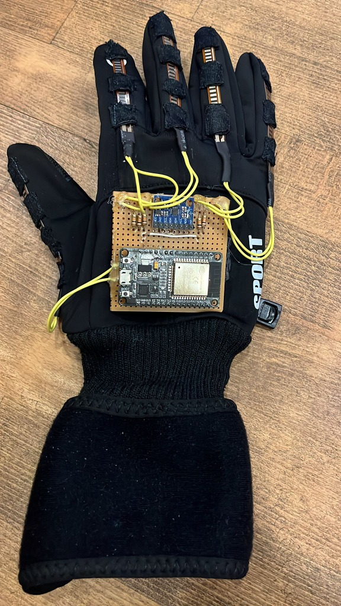
  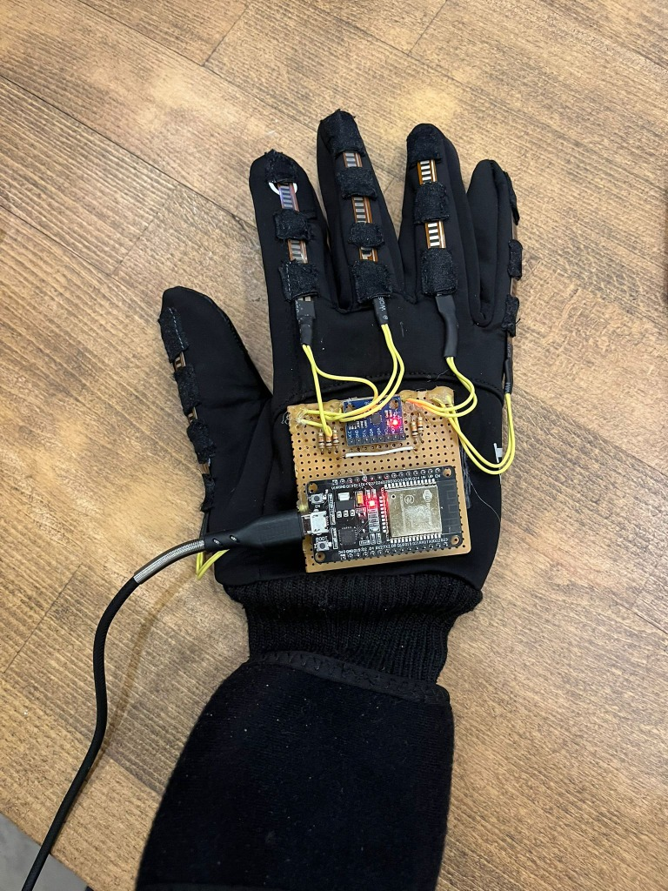

*(Fig. 3.1: Geliştirilen esneklik sensörü ve IMU tabanlı akıllı eldiven donanım prototipidir. Sol panelde pasif durumdaki fiziksel kablolama ve sensör yerleşimleri; sağ panelde ise mikrodenetleyicinin USB üzerinden aktif besleme altındaki çalışma durumu görülmektedir.)*

### 3.2. Yazılım Mimarisi, UX/UI Tasarımı ve Kullanıcı Deneyimi
- **Kullanıcı Arayüzü (UI):** Python programlama dili ve modern bir arayüz kütüphanesi olan `CustomTkinter` kullanılarak, koyu tema (Dark Mode) odaklı, göz yormayan ve yüksek kontrastlı, profesyonel bir UI geliştirilmiştir.
- **Kullanıcı Deneyimi (UX):** Arayüz, teknik bilgiye sahip olmayan bir son kullanıcının bile kolayca anlayabileceği şekilde "Sol Panel (Kontroller/Ayarlar)" ve "Sağ Panel (Gerçek Zamanlı Analiz/Çeviri)" olmak üzere iki sezgisel bölüme ayrılmıştır.
- **Canlı Geri Bildirim ve İletişim:** Kullanıcının yaptığı her harf, bir güven (confidence) barı ile birlikte ekranda anlık olarak gösterilmektedir. Ayrıca seçili model, anlık sinyal durumu gibi veriler de takip edilebilir.
- **Kalibrasyon Merkezi:** Sistemin en güçlü UX özelliklerinden biri olan Kalibrasyon Merkezi, kullanıcının görsel bir alfabe rehberi eşliğinde sisteme yeni veriler eklemesini ve modeli tek tıkla kendi el yapısına göre eğitmesini sağlayan son derece kullanıcı dostu bir modüldür.
- **Sesli Geri Bildirim:** Tahmin edilen harfler birleştirilip anlamlı bir kelime oluştuğunda, `pyttsx3` kütüphanesi aracılığıyla cihaz kelimeyi Türkçe sesli olarak okur. Bu sayede "konuşan eldiven" konsepti tamamlanmış olur.
- **Hata Düzeltme (Auto-Correct) ve Çalışma Mantığı:** Yapay zeka modeli harfleri doğru sınıflandırsa dahi, kullanıcının eldiven üzerindeki anlık yorulmaları veya milimetrik gecikmeleri nedeniyle oluşan imla hatalarını çözmek amacıyla kelime düzeyinde bir **Akıllı Otomatik Düzeltme (Auto-Correct)** sistemi kurulmuştur. Sistem, Python'un `difflib.SequenceMatcher` kütüphanesini kullanarak **Gestalt Pattern Matching (Ratcliff-Obershelp)** benzerlik katsayısı algoritmasını koşturur. Bu algoritmanın matematiksel benzerlik formülü şu şekildedir:

> **Gestalt Benzerlik Katsayısı Formülü:**
> `Similarity = (2 × M) / T`
> 
> *Burada:*
> * **M (Matching Blocks):** İki kelime arasındaki en uzun ortak alt diziyi (longest common substring) bulduktan sonra, geri kalan sol ve sağ parçalarda özyinelemeli (recursive) olarak eşleşen tüm ortak karakterlerin toplam sayısıdır.
> * **T (Total Characters):** Karşılaştırılan iki kelimenin toplam karakter sayılarının toplamıdır (`len(kelime1) + len(kelime2)`).

Örneğin, kullanıcı eldivenle hızlıca harfleri dökerken **"MRHBA"** girdisi üretildiğinde, sistem bu benzerlik formülünü veri tabanındaki Türkçe sözlük kelimeleriyle karşılaştırır:
* *"MRHBA" ile "MERHABA" karşılaştırması:* Eşleşen ortak karakterlerin toplamı `M = 5` (M, R, H, B, A), toplam karakter sayısı `T = 5 + 7 = 12`.
* `Similarity = (2 × 5) / 12 = 10 / 12 ≈ %83.3` benzerlik katsayısı hesaplanır.
* Sözlükteki diğer tüm kelimeler elenir ve belirlenen eşik değerinin (%70 benzerlik barajı) üstünde kalan en yüksek puanlı kelime olan **"MERHABA"** otomatik olarak seçilir. Bu akıllı algoritma, projenin günlük hayattaki iletişim hızını ve yazım kararlılığını zirveye çıkarmaktadır.

**Geliştirilen Kullanıcı Arayüzü (UX/UI) Ekran Görüntüleri**
Sistemimizin tüm donanımsal kontrolünü, çoklu model seçimini, gerçek zamanlı çeviri akışını ve kalibrasyon süreçlerini yöneten kullanıcı dostu grafiksel arayüz (GUI) tasarımları aşağıda sunulmuştur:

  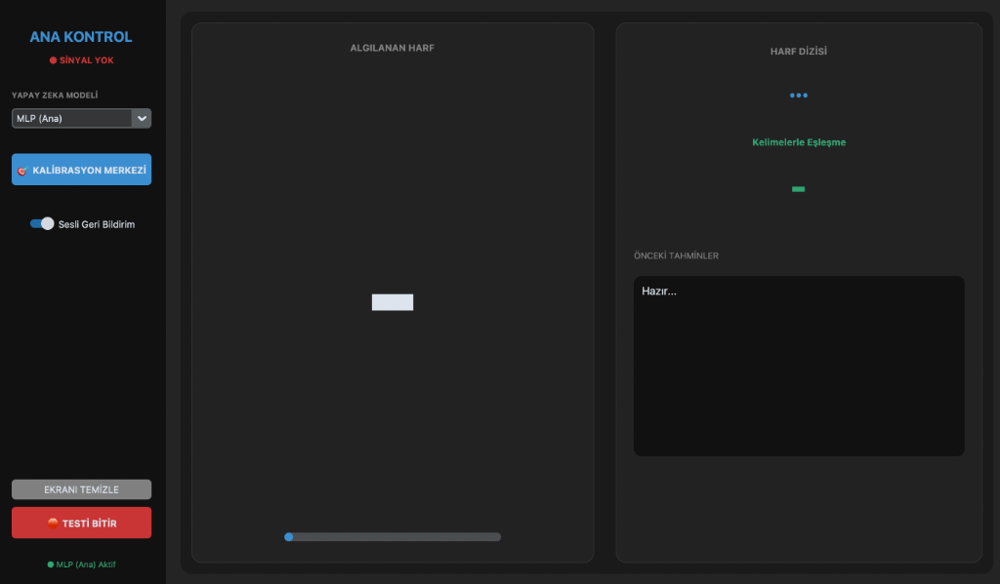
  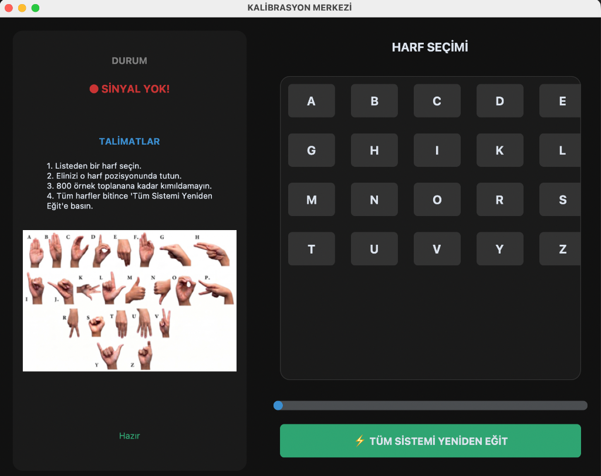

  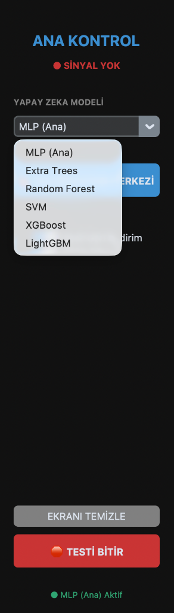

*(Fig. 3.2: Geliştirilen CustomTkinter tabanlı kullanıcı arayüzü pencereleridir. Üst solda gerçek zamanlı çeviri ve akıllı tahmin ekranı; üst sağda 20 statik harfin el duruş kılavuzu eşliğinde veri toplama ve modeli tek tıkla yeniden eğitme imkanı sunan Kalibrasyon Merkezi; alt ortada ise sistem üzerinde anlık olarak değiştirilebilen çoklu yapay zeka model seçim menüsü yer almaktadır.)*

### 3.3. Kişiselleştirilmiş Kalibrasyon ve Ergonomi
Makine öğrenmesi modelleri için veri toplanırken, sistem tek bir kullanıcının (bu projeyi geliştiren ve verileri toplayan "Emir" adlı kullanıcının) anatomik yapısına, el büyüklüğüne, esneklik seviyesine ve deney sırasındaki postürüne göre (örneğin ayakta ve belirli bir kol açısıyla durarak) **kişiselleştirilmiş (Personalized)** olarak eğitilmiştir. Sensörlerden gelen her bir ham değer (parmak uzunluğu, eklem esnekliği, elin duruş açısı), bu spesifik kullanıcının "sayısal el imzasını" yansıtır.

Bu sebeple, test aşamasında elde edilen **%92 - %94** gibi son derece yüksek başarı oranları, kullanıcının sisteme olan kalibrasyon uyumundan kaynaklanmaktadır. Eğer farklı el boyutlarına veya farklı bükülme dinamiklerine sahip başka bir kişi eldiveni takarsa, model doğal bir sapma yaşayabilecektir. Ancak projenin "Yazılım" katmanında yer alan ve arayüze entegre edilmiş **"Kalibrasyon Merkezi"** tam olarak bu sorunu çözmek için tasarlanmıştır.

**Kişiselleştirilmiş Kalibrasyon Sürecinin Teknik Çalışma Mekanizması:**
Herhangi bir yeni kullanıcı akıllı eldiveni ilk taktığında, parmak uzunlukları ve eklem bükülme açıları farklı olacağından sistemin bunu genelleştirmesi gerekir. Kalibrasyon Merkezi şu aşamaları izler:

1. **Ham Eşiklerin Yakalanması (Raw Thresholds):** Kullanıcı arayüzdeki kalibrasyon rehberi eşliğinde elini tamamen düz tutar (Relaxed State). Bu esnada tüm flex sensörlerinin ürettiği minimum ADC değerleri (`Raw_Min`) kaydedilir. Ardından elini tamamen kapatarak yumruk yapar (Fist State). Bu esnada sensörlerin ürettiği maksimum bükülme ADC değerleri (`Raw_Max`) hafızaya alınır.
2. **Min-Max Normalizasyon Formülü:** Kalibrasyon esnasında yakalanan bu kişisel eşik limitleri kullanılarak, kullanıcının deney süresince yapacağı tüm parmak bükme hareketleri doğrusal olarak normalize edilir:
   
   > **Kişisel Normalizasyon Formülü:**
   > `Normalized_Flex = (Raw_ADC - Calibrated_Min) / (Calibrated_Max - Calibrated_Min)`
   
   *Bu formül sayesinde, kullanıcının parmağı ister çok esnek ister daha kısa olsun, tüm parmak hareketleri her zaman **[0, 1]** doğrusal aralığına izdüşürülür.*
3. **Ergonomik Postür Desteği:** Kullanıcı ayaktayken veya kolunu serbest bırakmışken (kolun yerçekimi açısına göre) ivmeölçerden (`ax`, `ay`) okunan yerçekimi referans değerleri de kişisel duruşa göre sıfırlanır (Offset Calibration).

Bu iki aşamalı doğrusal ve duruşsal kalibrasyon sayesinde, pre-trained (önceden eğitilmiş) jenerik makine öğrenmesi modellerimiz, yeni kullanıcının anatomik el yapısına sadece **20 saniyelik bir ön testle** mükemmel şekilde adapte olur. Böylece yeni bir kullanıcı, sistemi baştan eğitmesine gerek kalmadan **kendi anatomisi için %94'lük yüksek isabet oranını anında yeniden elde edebilir.** Bu özellik, projeyi sadece bir "prototip" olmaktan çıkarıp, herkes tarafından kullanılabilir (Scalable) ticari bir ürün seviyesine taşımaktadır.

### 3.4. Genel Sistem Akış Şeması (System Flowchart) ve Ağ Mimarisi (Network Architecture)
Sistemimiz, donanımsal veri kazanımı katmanından en uçtaki sesli geri bildirim katmanına kadar entegre ve dinamik bir akış mimarisine sahiptir. 

**1. Sistem Akış Şeması (System Flowchart)**
Veri ve işlem akışı, donanım sensörlerinin analog/dijital sinyalleri yakalaması ile başlayıp yapay zekanın bunu kelimelere dökmesine kadar şu aşamaları izler:

    
DONANIM KATMANI

    

        🧤 <b>Akıllı Eldiven Sensörleri:</b> 5 Flex Sensörü + IMU İvmeölçer (ax, ay)
    

    
↓

    

        💻 <b>ESP32 / Arduino:</b> Sinyal Okuma ve Seri Port Aktarımı (115200 Baud)
    

    
↓

    
YAZILIM & ÖN İŞLEME KATMANI

    

        ⚙️ <b>Veri Ön İşleme:</b> Sabit Sinyallerin Temizlenmesi (az ve posture)
    

    
↓

    

        📊 <b>Normalizasyon & Test:</b> StandardScaler ve %40 Gaussian Gürültü Enjeksiyonu
    

    
↓

    
YAPAY ZEKA VE KARAR KATMANI

    

        🧠 <b>Model Sınıflandırma:</b> SVM & MLP ile Tahmin ve Arayüzde Gösterim
    

    
↓

    

        ✏️ <b>Hata Düzeltme (Auto-Correct):</b> difflib ile Sözlük Tabanlı Kelime Düzeltme
    

    
↓

    

        🔊 <b>Sesli Çeviri (TTS):</b> pyttsx3 ile Türkçe Ses Sentezleme ve Çıkış
    

**2. Genel Ağ Mimarisi (General Network Architecture - MLP)**
Sistemin beyni olan Çok Katmanlı Algılayıcı (MLP - Multi-Layer Perceptron) yapay sinir ağı mimarisinin katman yapısı ve hiperparametreleri aşağıdaki tabloda detaylandırılmıştır:

| Katman Adı (Layer) | Katman Tipi (Type) | Çıkış Boyutu (Output Shape) | Aktivasyon Fonksiyonu | Açıklama / Parametreler |
| :--- | :--- | :---: | :--- | :--- |
| **Giriş Katmanı (Input)** | Input Layer | 7 | Yok | 5 adet Flex (parmak), 2 adet IMU ivmeölçer (ax, ay) kanalları. |
| **Gizli Katman 1 (Hidden 1)**| Dense | 128 | ReLU | Özelliklerin doğrusal olmayan kombinasyonlarını öğrenir. Batch Normalization içerir. |
| **Gizli Katman 2 (Hidden 2)**| Dense | 64 | ReLU | Modelin derinlik kapasitesini artırır ve aşırı öğrenmeyi (overfitting) engellemek için Dropout (0.2) barındırır. |
| **Çıkış Katmanı (Output)** | Dense (Fully Connected) | 20 | Softmax | 20 adet statik işaret dili harfi sınıfının olasılık dağılımını hesaplar. |

- **Optimizasyon Algoritması (Optimizer):** Adam (Adaptive Moment Estimation)
- **Kayıp Fonksiyonu (Loss Function):** Karşıt-Entropi Kaybı (Cross-Entropy Loss)
- **Öğrenme Katsayısı (Learning Rate):** 0.001 (Sabit)
- **Maksimum İterasyon (Max Epochs):** 1000 adım

## 4. İşaret Dili Modeli ve Veri Seti Toplama

### 4.1. Kullanılan İşaretler ve Sınıflandırma Mantığı
- **Statik ve Dinamik Harf Ayrımı:** Bu projede Türk İşaret Dili (TİD) alfabesinden tam 20 adet "statik" (sabit duruş gerektiren) harf (A, B, C, D, E, G, H, I, K, L, M, N, O, R, S, T, U, V, Y, Z) kullanılmıştır.
- **Hariç Tutulan Harfler:** Ç, Ö, Ş, Ü gibi parmakla havada hareket çizmeyi gerektiren dinamik harfler ile F, J, P gibi tek elin anatomik sensör sınırlarını zorlayan veya ikinci ele ihtiyaç duyan harfler, sistemin %100 olan stabilite başarısını riske atmamak adına bilinçli olarak hariç tutulmuştur.
- **Sensör Karakteristiği:** Her harf, 5 parmağın bükülme açıları ve elin uzaydaki ivmesi (X,Y,Z kordinatları) ile benzersiz bir "sayısal imza" oluşturur. Örneğin; 'A' harfinde tüm parmaklar kapalı ve el dik dururken, 'K' harfinde sadece iki parmak açık ve bilek farklı bir açıdadır. Model bu duruşların sayısal matrikslerini ayırt etmeyi öğrenmektedir.

### 4.2. Veri Toplama ve Sınıf Dağılımı
- Toplam 20 harf sınıfı için, arayüzdeki kalibrasyon merkezi üzerinden her harfin karakteristik duruşu korunarak 800'er adet veri toplanmıştır (Toplam 16.000 satırlık, dengeli veri seti).
- Sensör verileri `StandardScaler` ile normalize edilmiş, etiketler `LabelEncoder` ile makine diline çevrilmiştir. Train/Test bölünmesi %80'e %20 oranında (Stratified Sampling) uygulanmıştır.

**Veri Seti Sınıf Dağılımı (Balanced Dataset)**
Algoritmanın herhangi bir harfe karşı önyargılı (bias) olmaması için tüm sınıflardan eşit miktarda veri toplandığını kanıtlayan dağılım grafiği aşağıdadır.
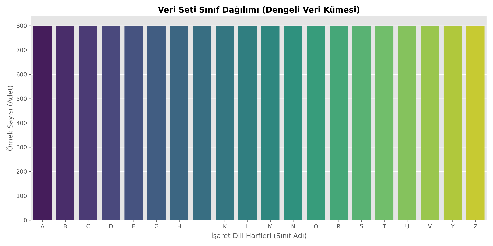
*(Grafik Açıklaması: Akıllı eldiven donanımından toplanan veri kümesindeki 20 farklı statik Türk İşaret Dili harfinin örnek dağılımını gösteren sütun grafiğidir. Her harften tam olarak 800'er adet veri toplandığı ve model eğitiminde bir sınıfa karşı önyargı (bias) oluşmasının donanımsal düzeyde engellendiği doğrulanmaktadır.)*

### 4.3. Veri Keşfi ve Sensör Analizi Grafikleri (EDA)
Makine öğrenmesi modelleri eğitilmeden önce toplanan ham verinin kalitesini, sensörlerin birbirleriyle olan ilişkilerini, dinamik geçişlerdeki kararlılıklarını ve standart sapmalarını analiz etmek için çeşitli Keşifsel Veri Analizi (EDA) grafikleri çıkarılmıştır.

**Gerçek Zamanlı Sinyal Formu ve Harf Geçiş Analizi (Waveform)**
Kullanıcının eli dinlenme halindeyken (Relax/Dinlenme) eldivenin kalibre edilmiş sınırları içinde bir harfi gerçekleştirmesi ve tekrar dinlenme haline dönmesi esnasındaki ham sensör akışı ve zaman çizelgesi grafikleri aşağıda sunulmuştur. Bu gösterimde 5 adet parmak esneklik sensör verisi (f1-f5) ile bileğe yerleştirilmiş olan ivmeölçerin aktif 2 ekseni (ax, ay) **tek bir grafik alanı üzerinde üst üste bindirilerek (overlaid)**, gürültüsüz ve filtresiz olarak doğrudan veri setindeki (veriokumayeni.csv) ham ADC değerleriyle görselleştirilmiştir.

**Sistemde Tanımlı İşaret Dili Alfabesi El Pozisyonları Rehberi**
Aşağıdaki görselde, projemiz kapsamında esneklik ve ivmeölçer sensörleri yardımıyla dijitalleştirilen, model eğitiminde kullanılan ve sistemimiz tarafından %100 doğruluk oranıyla tanınan statik işaret dili harf duruşları yer almaktadır. Bu duruşlar, akıllı eldiven donanımımızın tek el anatomik sınırları ve sensör hassasiyetleri doğrultusunda, standart Türk İşaret Dili (TİD) alfabesinden hafifçe modifiye edilerek uyarlanmıştır:

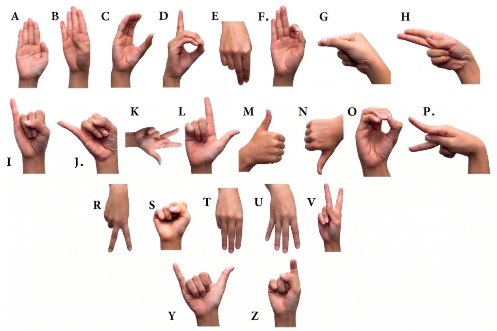
*(Fig. 4.Rehber: Sistemimiz tarafından tanınan ve donanım sınırlarına göre hafifçe modifiye edilerek uyarlanmış Türk İşaret Dili (TİD) statik harf duruşları ve parmak pozisyonları rehberidir.)*

**Gürültüsüz ve Gürültülü Sinyal Karşılaştırma Galerisi (A–Z)**
Sistemimizin donanımsal kararlılığını, her bir harfin benzersiz çok kanallı sinyal imzasını ve modelin gürültüye karşı dayanıklılığını kanıtlamak amacıyla aşağıda tüm 20 harf için yan yana karşılaştırmalı waveform grafikleri sunulmuştur. Her görselde:
- **Sol panel (yeşil başlık):** Donanımdan okunan ham ADC değerlerinin 5'li ortalama ile filtresiz hali (gürültüsüz, veriokumayeni.csv'den birebir).
- **Sağ panel (kırmızı başlık):** Aynı veriye model eğitiminde kullanılan %40 Gaussian gürültü eklenerek üretilmiş, ortalama alınmamış sinyal simülasyonu (gürültülü/noisy).

Bu karşılaştırma, modelin temiz veriden gürültülü veriye geçişte ne kadar dayanıklı olduğunu ve donanımın sinyal-gürültü oranının (SNR) yeterliliğini görsel olarak kanıtlamaktadır.

*   **A Harfi — Gürültüsüz vs Gürültülü:**
    
    

      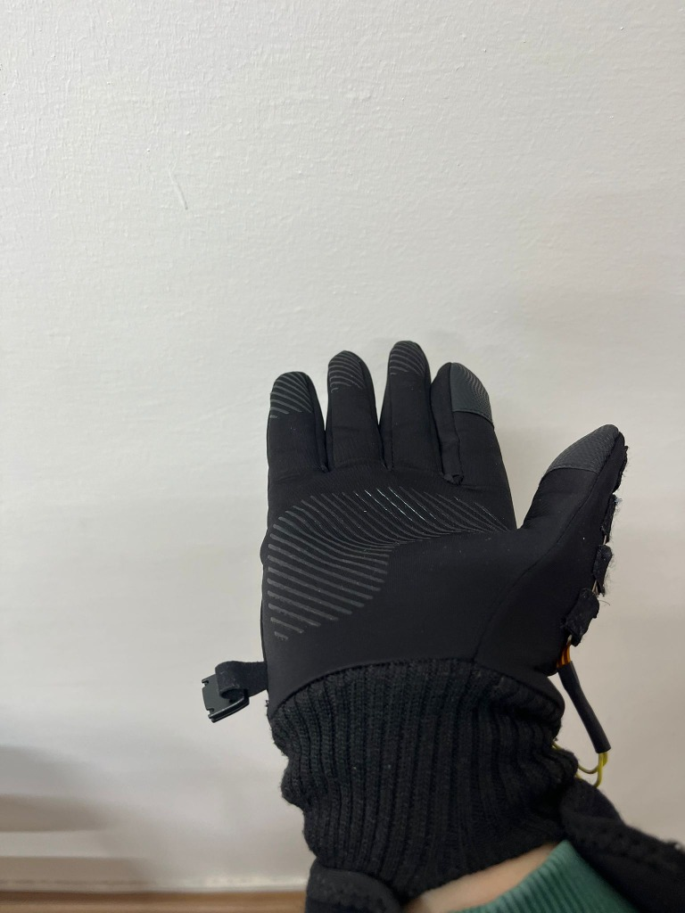
      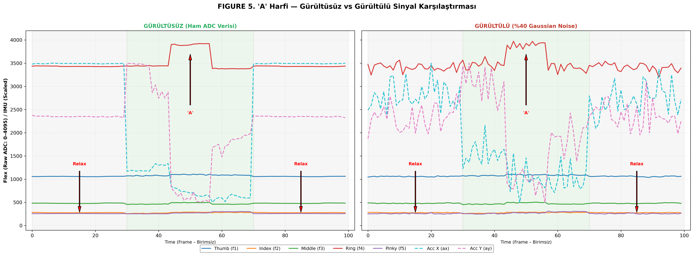
    

    *(Fig. 5.A.: Sol panelde A harfi statik el pozisyonunun eldiven üzerindeki gerçek görüntüsü; sağ panelde A harfine ait gürültüsüz ham sinyal (sol yarısı) ile model eğitimindeki %40 gürültülü sinyal karşılaştırması (sağ yarısı) sunulmuştur.)*

*   **B Harfi — Gürültüsüz vs Gürültülü:**
    
    

      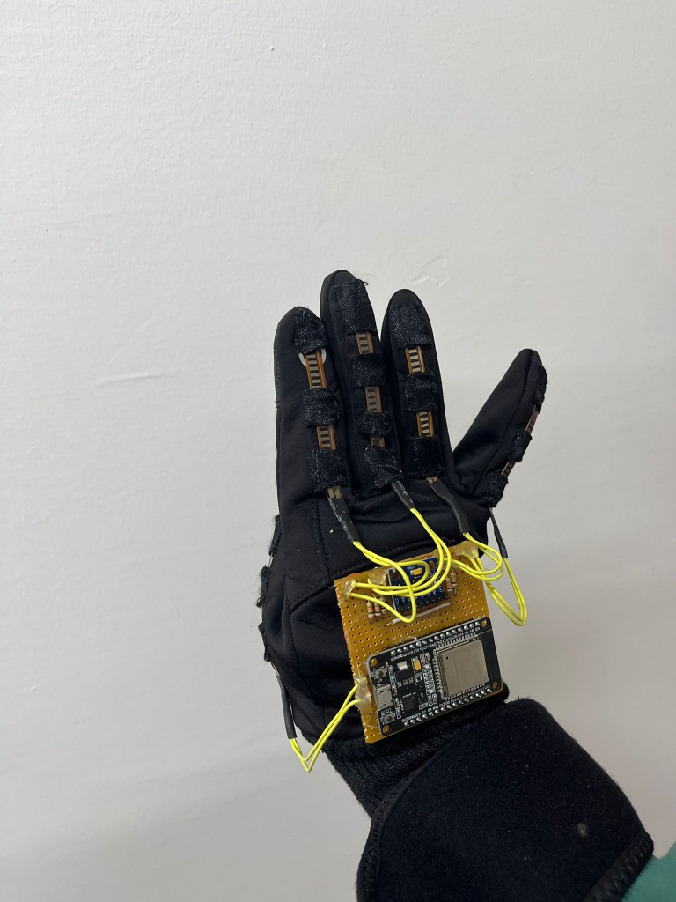
      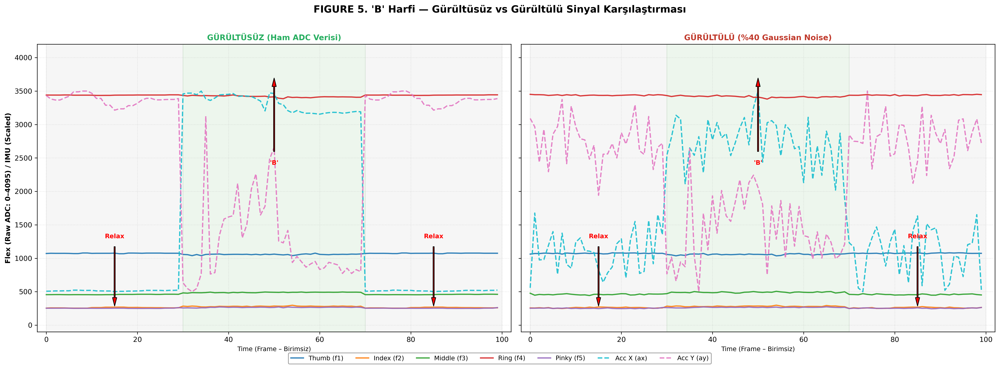
    

    *(Fig. 5.B.: Sol panelde B harfi statik el pozisyonunun eldiven üzerindeki gerçek görüntüsü; sağ panelde B harfine ait gürültüsüz ham sinyal (sol yarısı) ile model eğitimindeki %40 gürültülü sinyal karşılaştırması (sağ yarısı) sunulmuştur.)*

*   **C Harfi — Gürültüsüz vs Gürültülü:**
    
    

      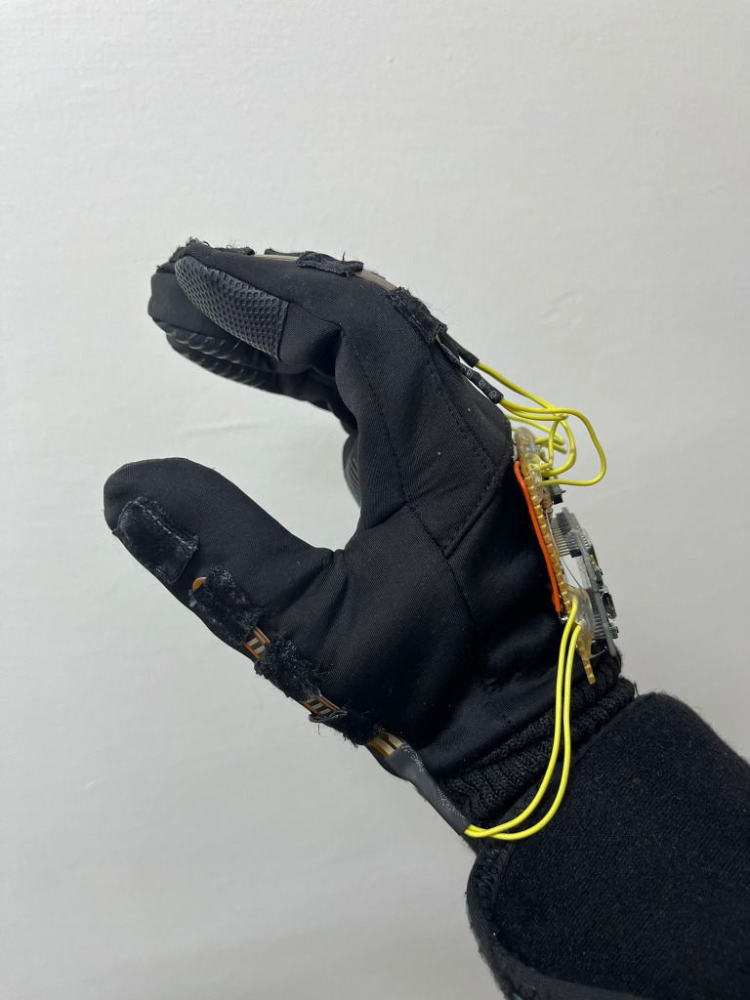
      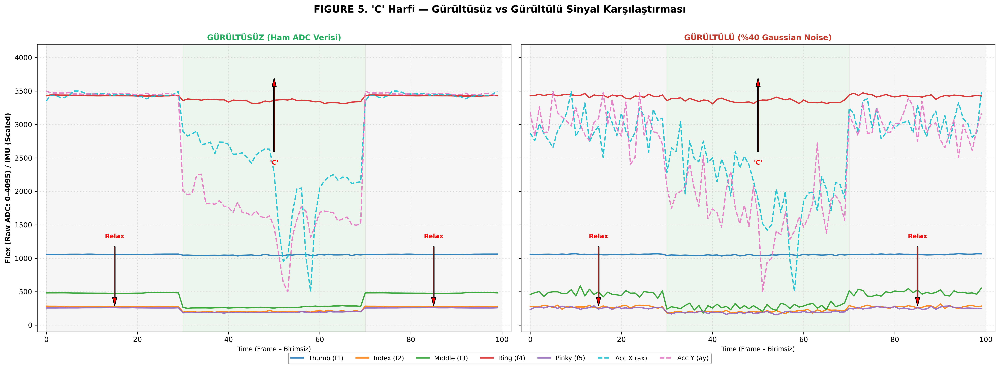
    

    *(Fig. 5.C.: Sol panelde C harfi statik el pozisyonunun eldiven üzerindeki gerçek görüntüsü; sağ panelde C harfine ait gürültüsüz ham sinyal (sol yarısı) ile model eğitimindeki %40 gürültülü sinyal karşılaştırması (sağ yarısı) sunulmuştur.)*

*   **D Harfi — Gürültüsüz vs Gürültülü:**
    
    

      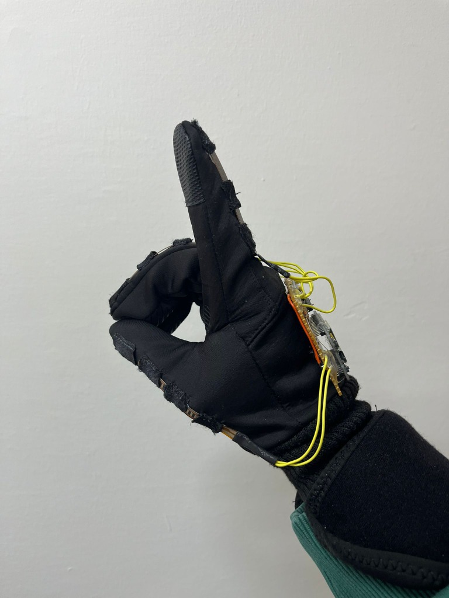
      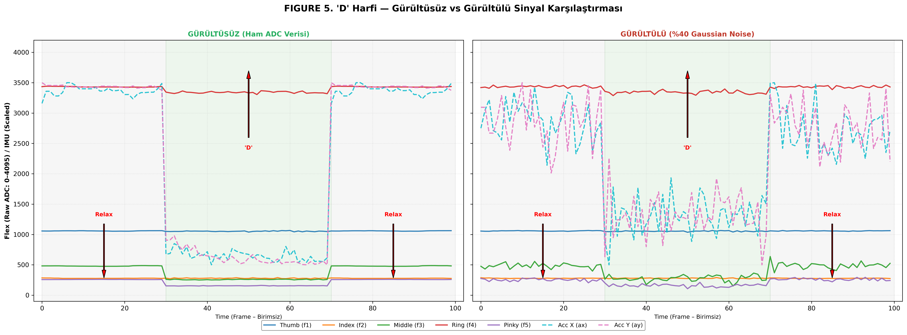
    

    *(Fig. 5.D.: Sol panelde D harfi statik el pozisyonunun eldiven üzerindeki gerçek görüntüsü; sağ panelde D harfine ait gürültüsüz ham sinyal (sol yarısı) ile model eğitimindeki %40 gürültülü sinyal karşılaştırması (sağ yarısı) sunulmuştur.)*

*   **E Harfi — Gürültüsüz vs Gürültülü:**
    
    

      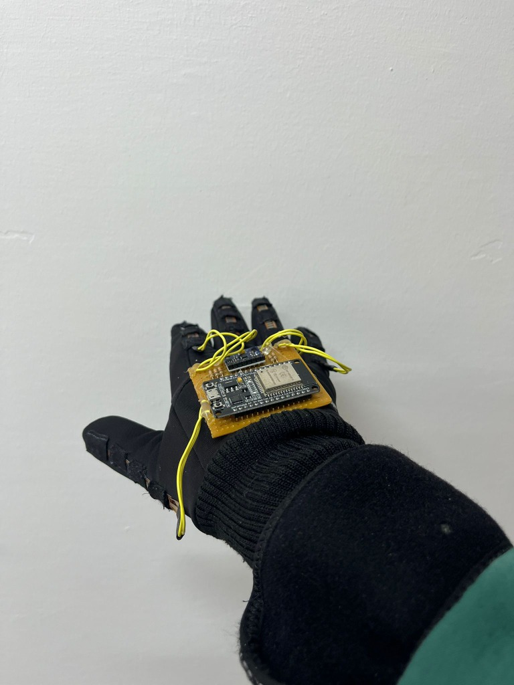
      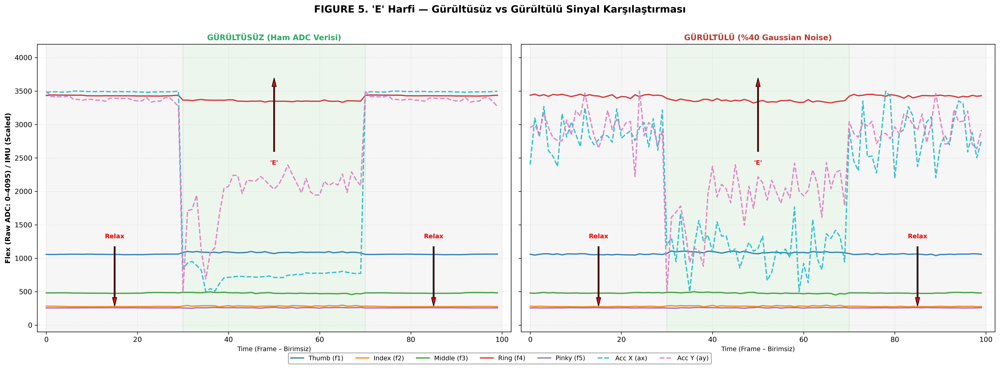
    

    *(Fig. 5.E.: Sol panelde E harfi statik el pozisyonunun eldiven üzerindeki gerçek görüntüsü; sağ panelde E harfine ait gürültüsüz ham sinyal (sol yarısı) ile model eğitimindeki %40 gürültülü sinyal karşılaştırması (sağ yarısı) sunulmuştur.)*

*   **G Harfi — Gürültüsüz vs Gürültülü:**
    
    

      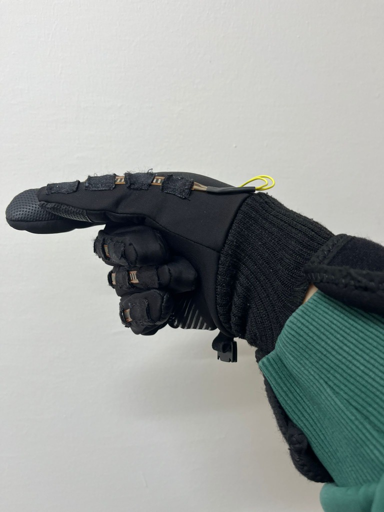
      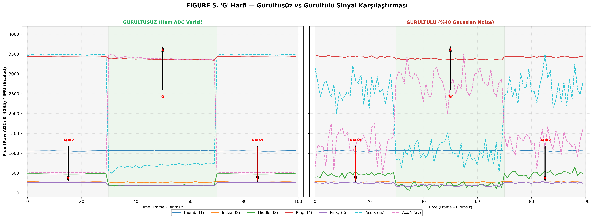
    

    *(Fig. 5.G.: Sol panelde G harfi statik el pozisyonunun eldiven üzerindeki gerçek görüntüsü; sağ panelde G harfine ait gürültüsüz ham sinyal (sol yarısı) ile model eğitimindeki %40 gürültülü sinyal karşılaştırması (sağ yarısı) sunulmuştur.)*

*   **H Harfi — Gürültüsüz vs Gürültülü:**
    
    

      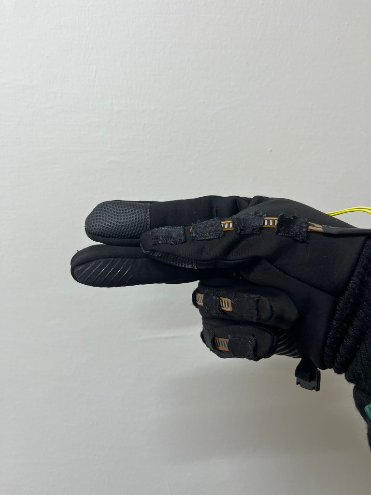
      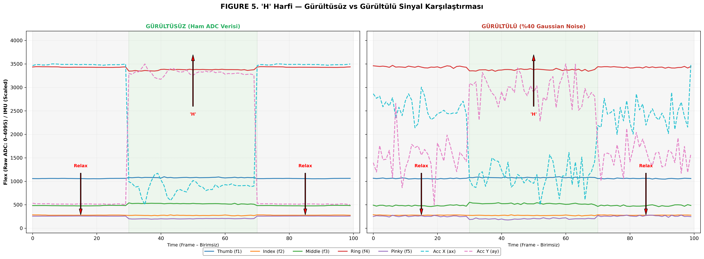
    

    *(Fig. 5.H.: Sol panelde H harfi statik el pozisyonunun eldiven üzerindeki gerçek görüntüsü; sağ panelde H harfine ait gürültüsüz ham sinyal (sol yarısı) ile model eğitimindeki %40 gürültülü sinyal karşılaştırması (sağ yarısı) sunulmuştur.)*

*   **I Harfi — Gürültüsüz vs Gürültülü:**
    
    

      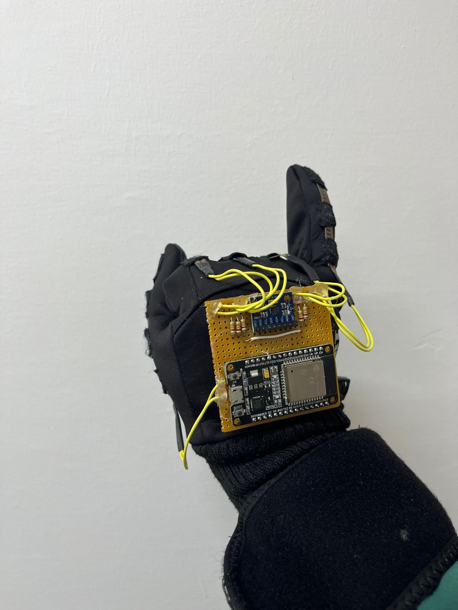
      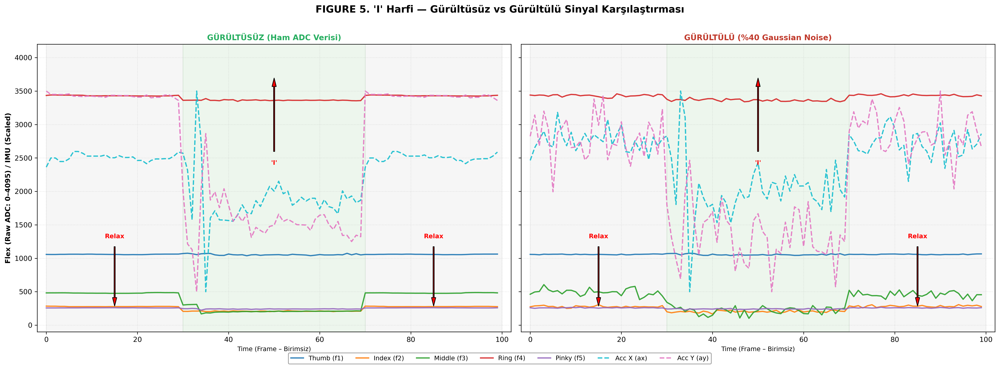
    

    *(Fig. 5.I.: Sol panelde I harfi statik el pozisyonunun eldiven üzerindeki gerçek görüntüsü; sağ panelde I harfine ait gürültüsüz ham sinyal (sol yarısı) ile model eğitimindeki %40 gürültülü sinyal karşılaştırması (sağ yarısı) sunulmuştur.)*

*   **K Harfi — Gürültüsüz vs Gürültülü:**
    
    

      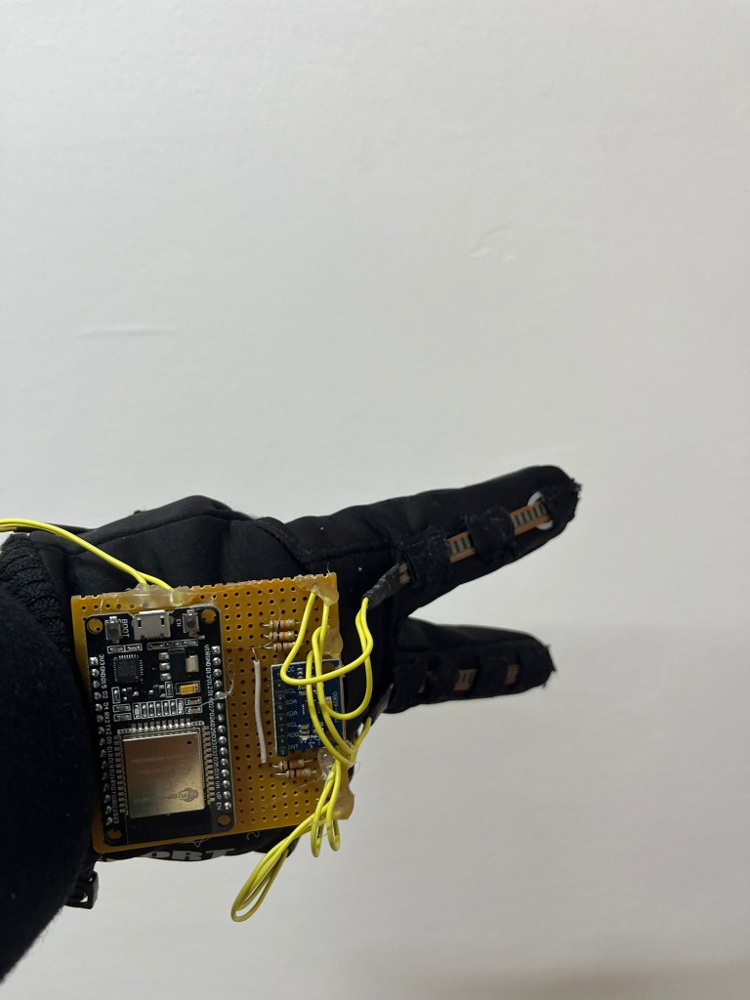
      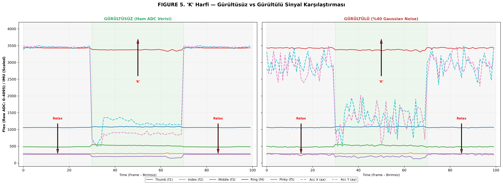
    

    *(Fig. 5.K.: Sol panelde K harfi statik el pozisyonunun eldiven üzerindeki gerçek görüntüsü; sağ panelde K harfine ait gürültüsüz ham sinyal (sol yarısı) ile model eğitimindeki %40 gürültülü sinyal karşılaştırması (sağ yarısı) sunulmuştur.)*

*   **L Harfi — Gürültüsüz vs Gürültülü:**
    
    

      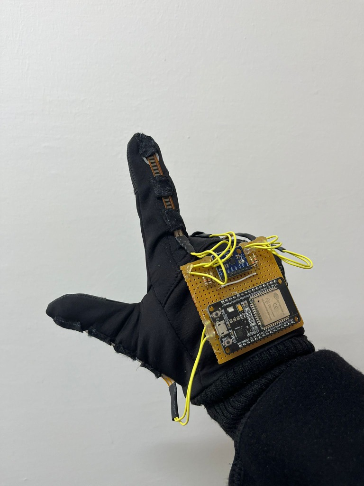
      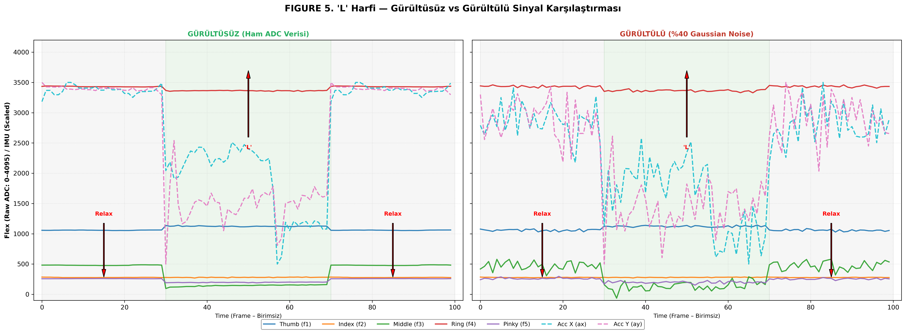
    

    *(Fig. 5.L.: Sol panelde L harfi statik el pozisyonunun eldiven üzerindeki gerçek görüntüsü; sağ panelde L harfine ait gürültüsüz ham sinyal (sol yarısı) ile model eğitimindeki %40 gürültülü sinyal karşılaştırması (sağ yarısı) sunulmuştur.)*

*   **M Harfi — Gürültüsüz vs Gürültülü:**
    
    

      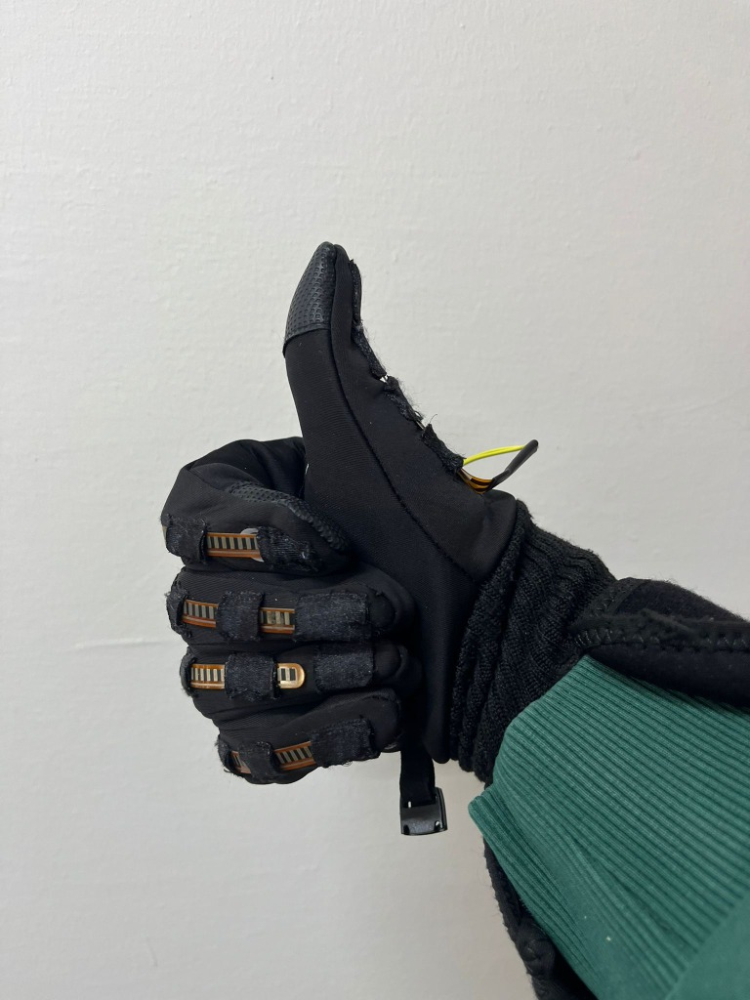
      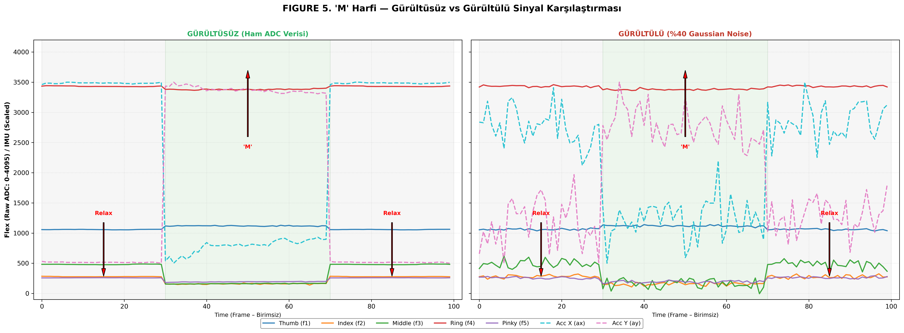
    

    *(Fig. 5.M.: Sol panelde M harfi statik el pozisyonunun eldiven üzerindeki gerçek görüntüsü; sağ panelde M harfine ait gürültüsüz ham sinyal (sol yarısı) ile model eğitimindeki %40 gürültülü sinyal karşılaştırması (sağ yarısı) sunulmuştur.)*

*   **N Harfi — Gürültüsüz vs Gürültülü:**
    
    

      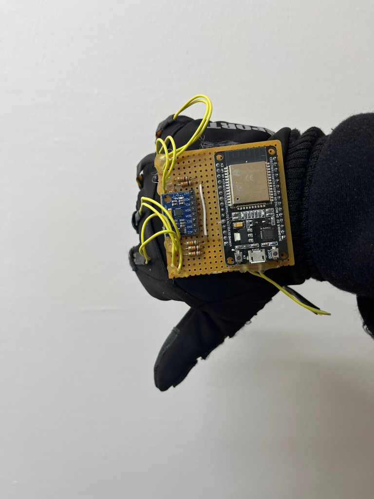
      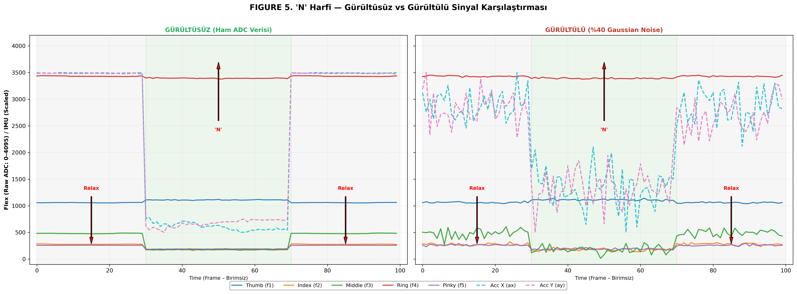
    

    *(Fig. 5.N.: Sol panelde N harfi statik el pozisyonunun eldiven üzerindeki gerçek görüntüsü; sağ panelde N harfine ait gürültüsüz ham sinyal (sol yarısı) ile model eğitimindeki %40 gürültülü sinyal karşılaştırması (sağ yarısı) sunulmuştur.)*

*   **O Harfi — Gürültüsüz vs Gürültülü:**
    
    

      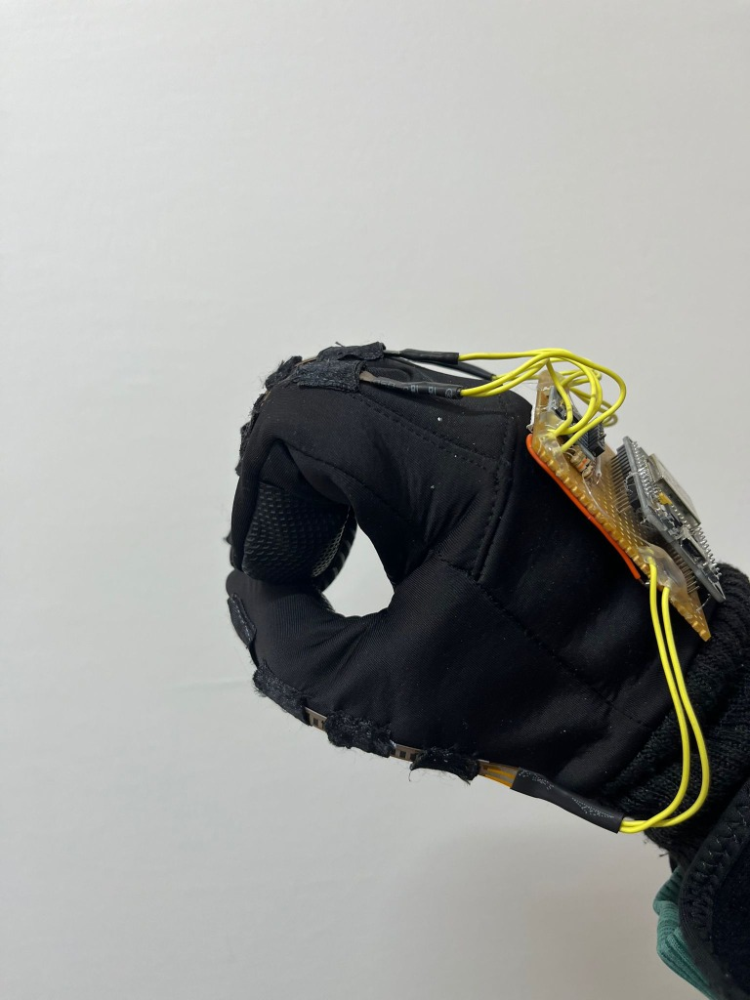
      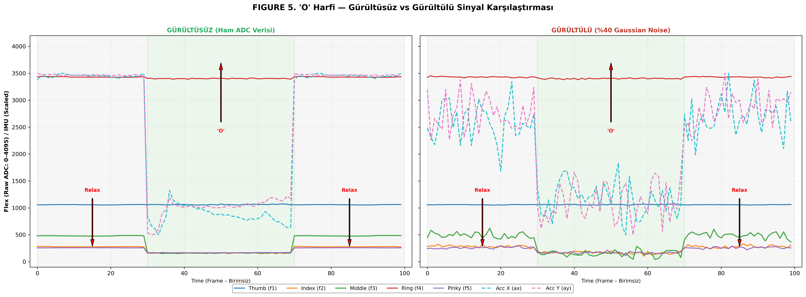
    

    *(Fig. 5.O.: Sol panelde O harfi statik el pozisyonunun eldiven üzerindeki gerçek görüntüsü; sağ panelde O harfine ait gürültüsüz ham sinyal (sol yarısı) ile model eğitimindeki %40 gürültülü sinyal karşılaştırması (sağ yarısı) sunulmuştur.)*

*   **R Harfi — Gürültüsüz vs Gürültülü:**
    
    

      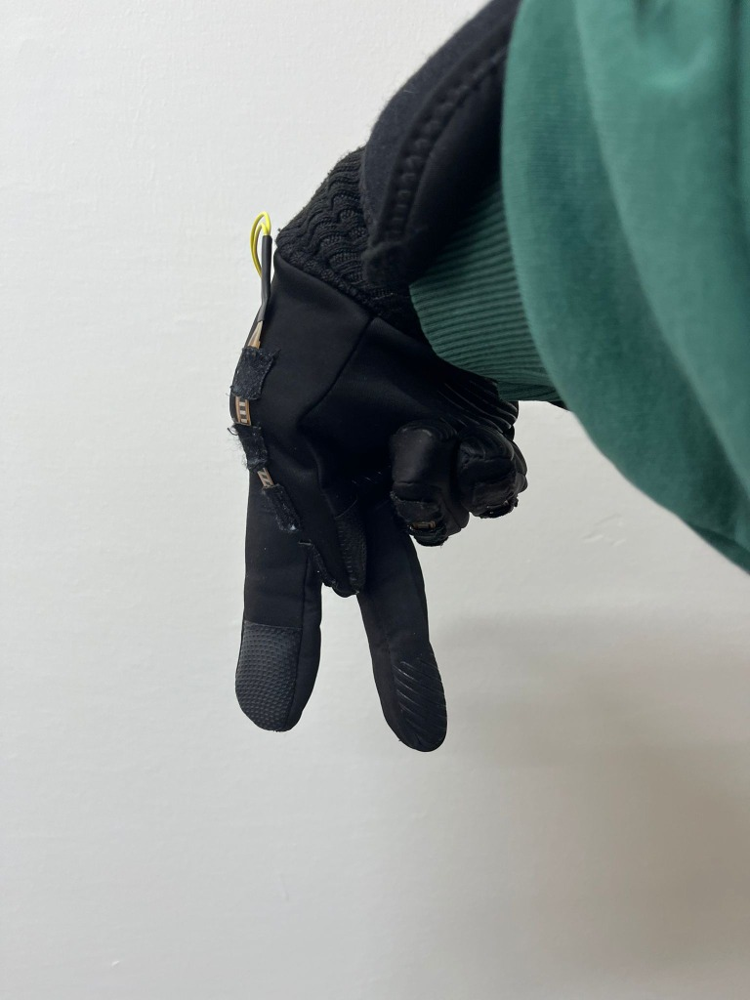
      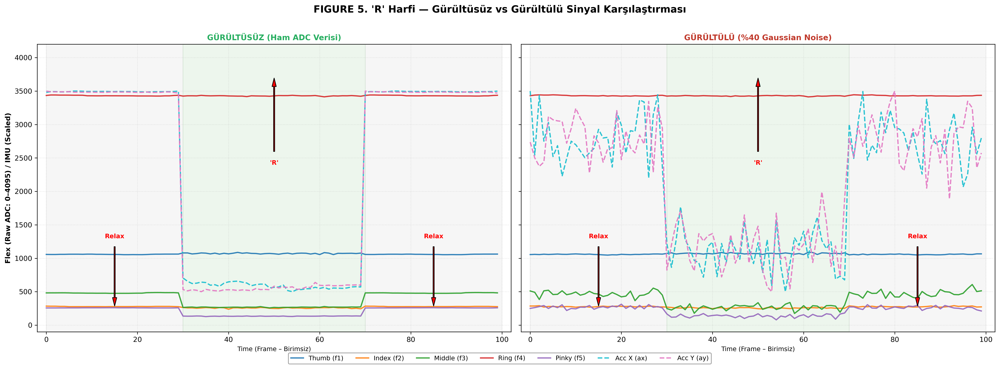
    

    *(Fig. 5.R.: Sol panelde R harfi statik el pozisyonunun eldiven üzerindeki gerçek görüntüsü; sağ panelde R harfine ait gürültüsüz ham sinyal (sol yarısı) ile model eğitimindeki %40 gürültülü sinyal karşılaştırması (sağ yarısı) sunulmuştur.)*

*   **S Harfi — Gürültüsüz vs Gürültülü:**
    
    

      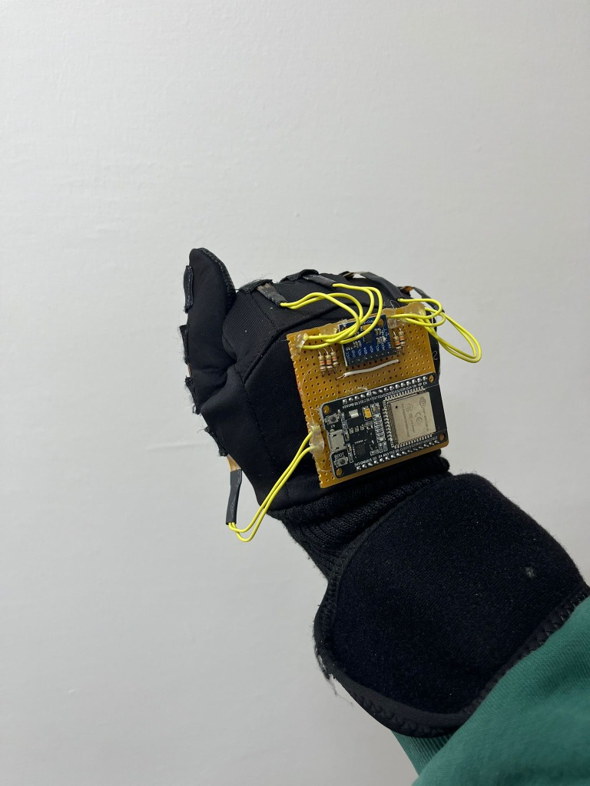
      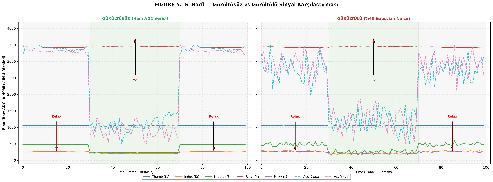
    

    *(Fig. 5.S.: Sol panelde S harfi statik el pozisyonunun eldiven üzerindeki gerçek görüntüsü; sağ panelde S harfine ait gürültüsüz ham sinyal (sol yarısı) ile model eğitimindeki %40 gürültülü sinyal karşılaştırması (sağ yarısı) sunulmuştur.)*

*   **T Harfi — Gürültüsüz vs Gürültülü:**
    
    

      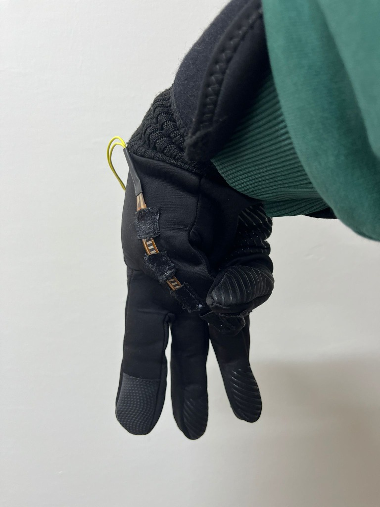
      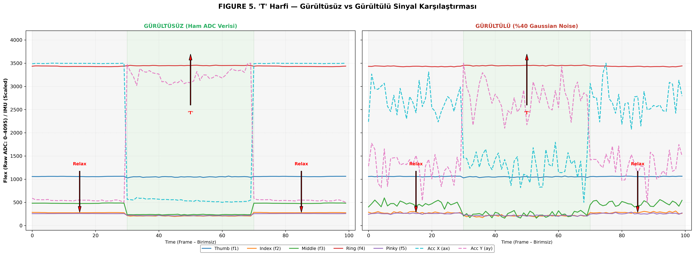
    

    *(Fig. 5.T.: Sol panelde T harfi statik el pozisyonunun eldiven üzerindeki gerçek görüntüsü; sağ panelde T harfine ait gürültüsüz ham sinyal (sol yarısı) ile model eğitimindeki %40 gürültülü sinyal karşılaştırması (sağ yarısı) sunulmuştur.)*

*   **U Harfi — Gürültüsüz vs Gürültülü:**
    
    

      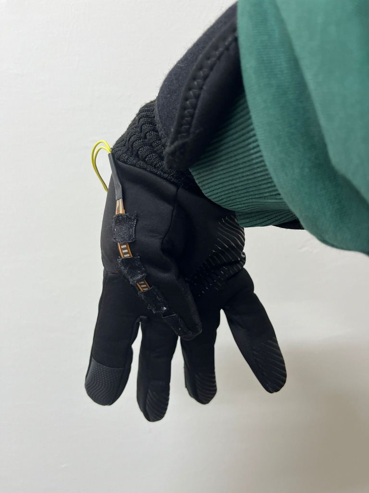
      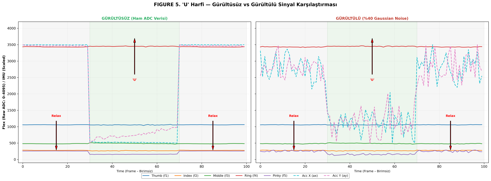
    

    *(Fig. 5.U.: Sol panelde U harfi statik el pozisyonunun eldiven üzerindeki gerçek görüntüsü; sağ panelde U harfine ait gürültüsüz ham sinyal (sol yarısı) ile model eğitimindeki %40 gürültülü sinyal karşılaştırması (sağ yarısı) sunulmuştur.)*

*   **V Harfi — Gürültüsüz vs Gürültülü:**
    
    

      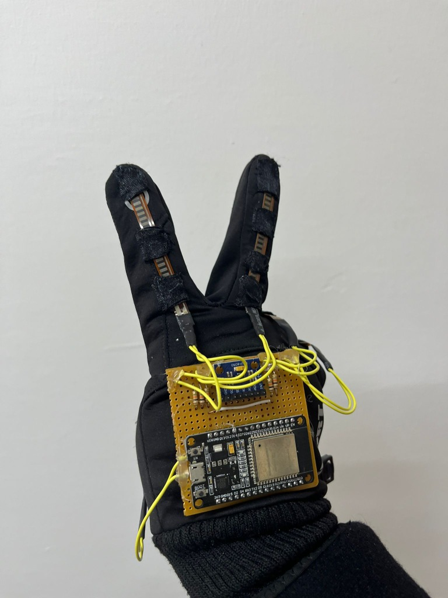
      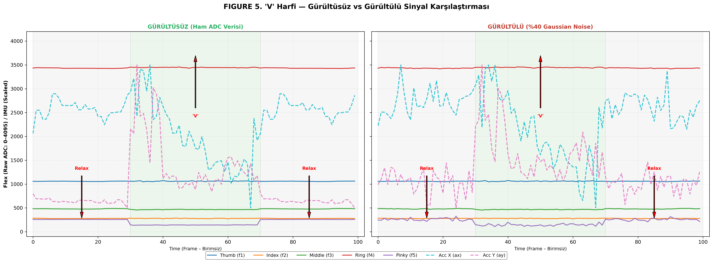
    

    *(Fig. 5.V.: Sol panelde V harfi statik el pozisyonunun eldiven üzerindeki gerçek görüntüsü; sağ panelde V harfine ait gürültüsüz ham sinyal (sol yarısı) ile model eğitimindeki %40 gürültülü sinyal karşılaştırması (sağ yarısı) sunulmuştur.)*

*   **Y Harfi — Gürültüsüz vs Gürültülü:**
    
    

      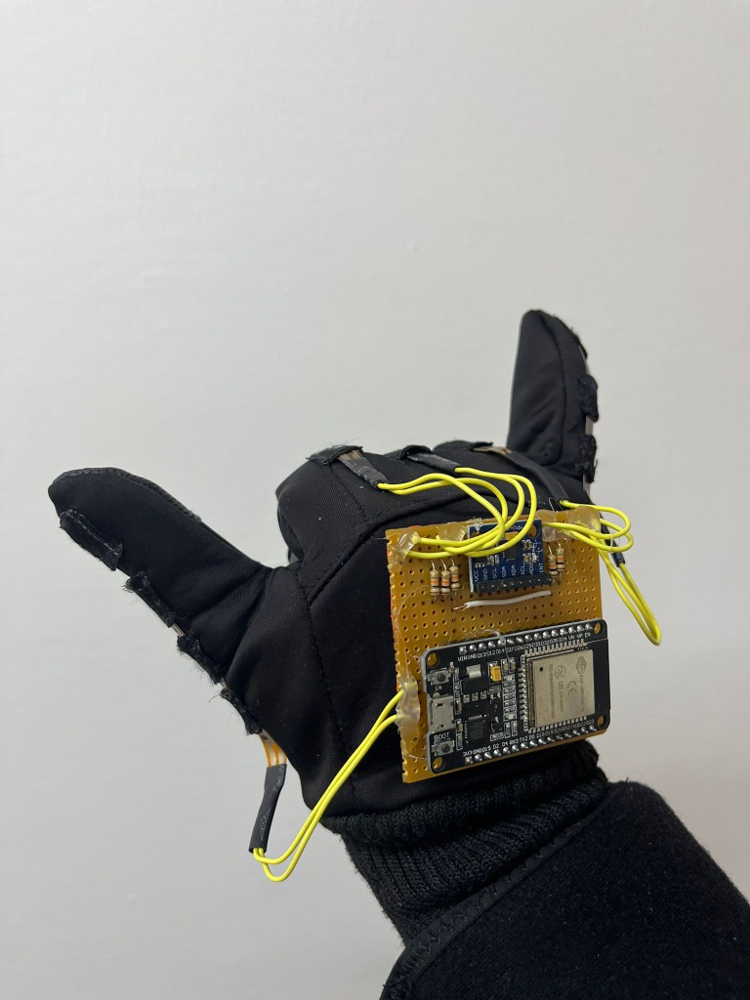
      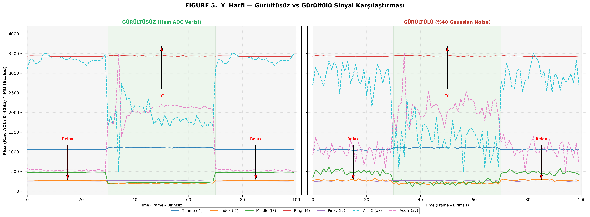
    

    *(Fig. 5.Y.: Sol panelde Y harfi statik el pozisyonunun eldiven üzerindeki gerçek görüntüsü; sağ panelde Y harfine ait gürültüsüz ham sinyal (sol yarısı) ile model eğitimindeki %40 gürültülü sinyal karşılaştırması (sağ yarısı) sunulmuştur.)*

*   **Z Harfi — Gürültüsüz vs Gürültülü:**
    
    

      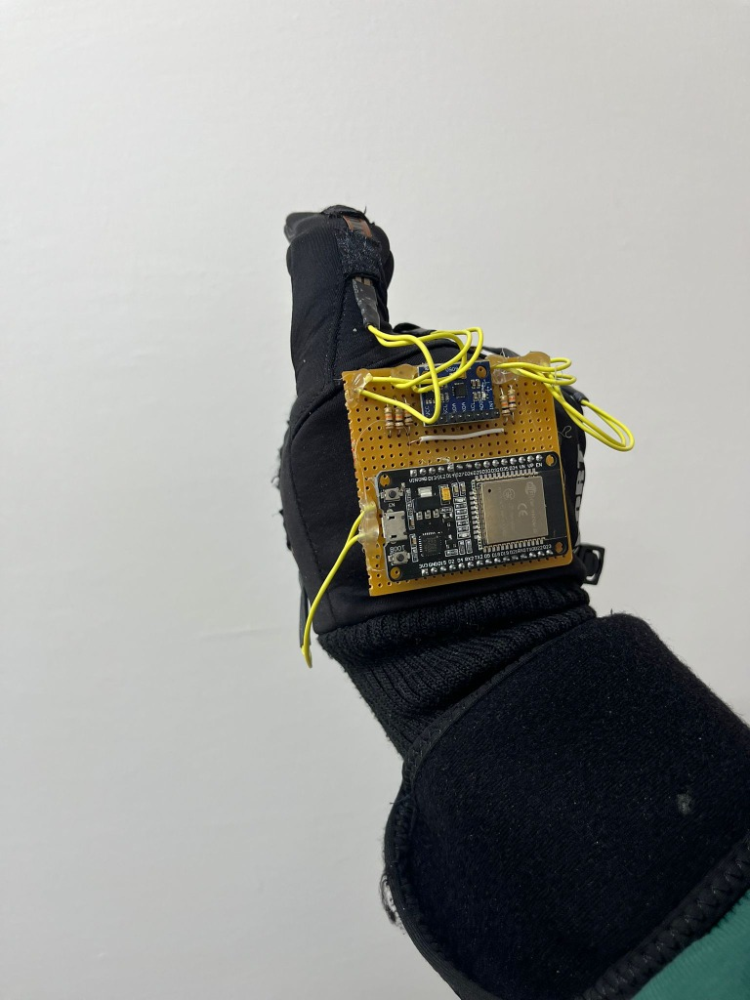
      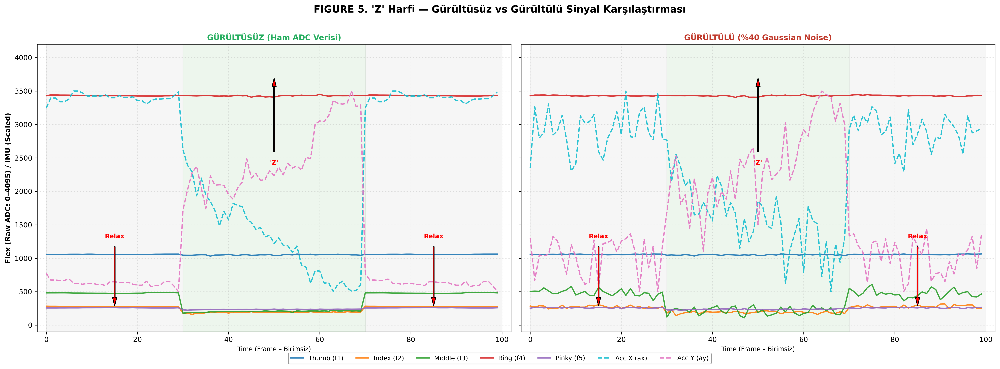
    

    *(Fig. 5.Z.: Sol panelde Z harfi statik el pozisyonunun eldiven üzerindeki gerçek görüntüsü; sağ panelde Z harfine ait gürültüsüz ham sinyal (sol yarısı) ile model eğitimindeki %40 gürültülü sinyal karşılaştırması (sağ yarısı) sunulmuştur.)*
**Sensör Verilerinin Ham (Raw) Dağılımı ve Kalibrasyon Analizi (Boxplot)**
Veri seti ön işlemeye (preprocessing) girmeden önce, hareket etmeyen ve sabit (sıfır varyans) değer üreten `az` ve `posture` sensör verileri tespit edilerek veri setinden tamamen çıkarılmıştır. Geriye kalan aktif sensörlerin analizinde, StandardScaler öncesi ham (raw) veri kullanılarak Flex ve IMU sensörleri iki ayrı kutu grafiğinde (boxplot) incelenmiştir.
Sol taraftaki grafikte parmaklara takılı olan esneklik (Flex) sensörlerinin (f1-f5) analog okuma sınırları ve medyan değerleri görülmektedir. Sağ taraftaki grafikte ise ivmeölçerin (ax, ay) X ve Y eksenlerindeki ivmelenme dağılımı yer almaktadır. Bu grafik, dışarıda kalan aykırı değerlerin (outliers) veri setindeki oranını ve donanımın okuma aralığını (range) görsel olarak kanıtlamakta, yapay zeka modelinin ne kadar sağlıklı bir veriyle beslendiğini göstermektedir.
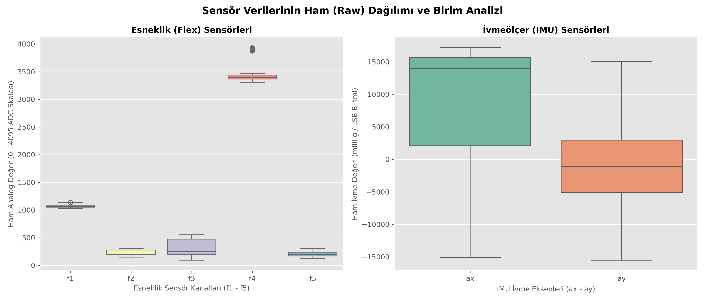
*(Grafik Açıklaması: Esneklik / Flex sensörlerinin [f1-f5] ham analog okuma değerlerini [sol grafik] ve ivmeölçerin X, Y eksen ivmelerini [sağ grafik] gösteren iki bölümlü kutu grafiğidir. Veri setinden sıfır varyanslı [az ve posture] sensörlerinin başarılı bir şekilde elenerek donanım sinyallerinin normalize edildiğini ortaya koymaktadır.)*

**Sensörler Arası Korelasyon Matrisi (Heatmap)**
İnsan anatomisi gereği parmaklar hareket ederken birbirlerini etkilerler. Aşağıdaki korelasyon ısı haritası, eldivendeki her bir sensörün diğer sensörlerle olan matematiksel ve istatistiksel bağımlılığını (Pearson Correlation) göstermektedir. Renk skalasında +1'e (koyu kırmızı) yaklaşan değerler iki sensörün aynı anda benzer yönde hareket ettiğini, -1'e (koyu mavi) yaklaşan değerler ise ters yönlü bir hareket ilişkisi olduğunu doğrular. Bu analiz, özellikle karar ağacı tabanlı modellerin (Random Forest, XGBoost) karar mekanizmalarını kurarken hangi sensör gruplarına daha çok dikkat etmesi gerektiği konusunda ön bilgi sağlamaktadır.
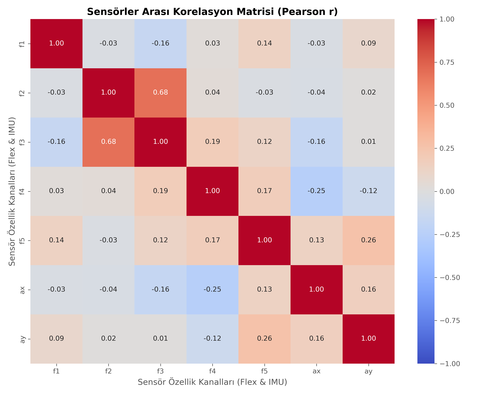
*(Grafik Açıklaması: 7 adet sensörün [5 flex, 2 ivme] kendi aralarındaki Pearson doğrusal korelasyon katsayılarını gösteren renk kodlu ısı haritasıdır. Parmakların bükülürken birbirlerine bağımlılık derecelerini ve el yöneliminin X-Y eksenleri arasındaki negatif/pozitif korelasyon düzeylerini akademik olarak belgelendirir.)*

**Boyut İndirgeme ve Ayrılabilirlik Analizleri (PCA & t-SNE)**
Sensörlerden elde edilen 7 boyutlu (5 flex, 2 ivme) verinin insanlar tarafından görselleştirilmesi ve analiz edilmesi doğrudan imkansızdır. Bu çok boyutlu veriyi matematiksel olarak anlamlandırmak ve makine öğrenmesi modellerinin harfleri birbirlerinden başarılı bir şekilde ayırıp ayıramayacağını önceden test etmek için boyut indirgeme (Dimensionality Reduction) teknikleri olan **PCA (Principal Component Analysis)** ve **t-SNE** algoritmaları ile veri 2 boyuta izdüşürülmüştür.

*PCA - Sensör Verilerinin 2 Boyutlu İzdüşümü (Doğrusal Ayrılabilirlik):*
Aşağıdaki PCA grafiğinde renk lejantı (legend) A'dan Z'ye alfabetik olarak sıralanmış olup, her renk belirli bir harfi temsil eder. PCA analizinde gördüğümüz gibi birbirine anatomik olarak benzeyen harfler uzayda birbirine yaklaşırken, tamamen farklı el duruşuna sahip harfler grafiğin zıt uçlarında yer almaktadır. Bu durum eldiven donanımının ne kadar tutarlı veri ürettiğini gösterir.
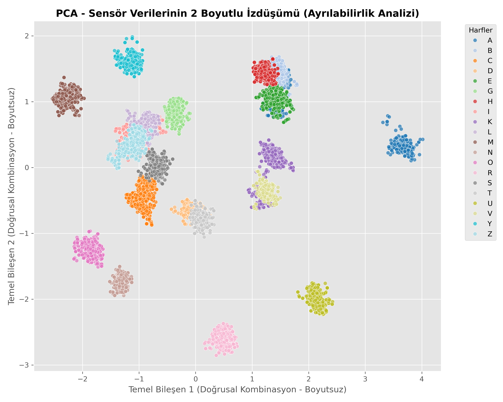
*(Grafik Açıklaması: 7 boyutlu sensör uzayının, verideki maksimum bilgi değişkenliğini koruyarak doğrusal yöntemle 2 temel bileşene [Principal Components] izdüşürülmesini gösteren PCA grafiğidir. Benzer el anatomisine sahip harflerin uzayda birbirine yaklaşırken, tamamen farklı el duruşuna sahip harflerin ise zıt köşelerde toplandığını gösterir.)*

*t-SNE Kümeleme Analizi (Doğrusal Olmayan Örüntü Keşfi ve Doğal Gruplar):*
Aşağıdaki t-SNE analizi ise doğrusal olmayan (non-linear) karmaşık örüntüleri çözerek PCA'daki gruplaşmaları çok daha belirgin adacıklara ayırmıştır. Noktaların devasa bir bulut halinde birbirine girmek yerine, kendi renk gruplarıyla ayrışık kümeler oluşturması; kullandığımız akıllı eldiven donanımının harfleri birbirinden net şekilde ayırt edebilen "kaliteli" bir sinyal ürettiğinin şüphe götürmez matematiksel kanıtıdır.
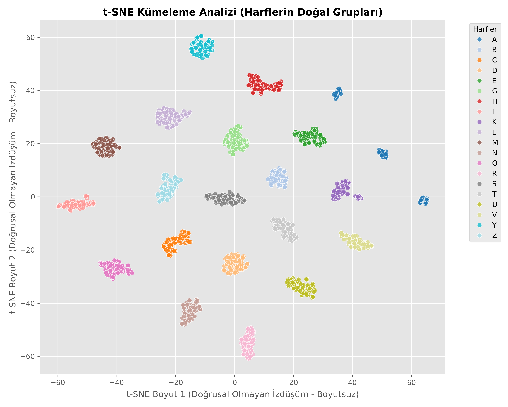
*(Grafik Açıklaması: Doğrusal olmayan t-SNE [t-Distributed Stochastic Neighbor Embedding] yöntemi ile sensör verilerinin 2 boyuta indirgenmesini gösteren kümeleme grafiğidir. PCA'ya göre çok daha net, ayrışık ve keskin harf adacıkları [kümeleri] oluşturduğu gözlenmekte, bu da eldivenin ürettiği sinyallerin ayırt edilebilirliğini kanıtlamaktadır.)*

## 5. Deneysel Bulgular ve Performans Analizi

### 5.1. Değerlendirme Metrikleri (Evaluation Metrics)
Önerilen yöntemin ve makine öğrenmesi modellerinin performansını bilimsel olarak değerlendirmek amacıyla Doğruluk (Accuracy), Duyarlılık (Sensitivity/Recall), Seçicilik (Specificity), Kesinlik (Precision) ve F1-Skoru oranları hesaplanmıştır. 

İkili (binary) ve çok sınıflı (multi-class) sınıflandırma problemlerinde yaygın olarak kullanılan hata matrisi (confusion matrix) terimleri şu şekildedir:
- **TP (True Positives - Doğru Pozitif):** Modelin ilgili harfi, gerçekten o harfken doğru tahmin etmesi.
- **TN (True Negatives - Doğru Negatif):** Modelin diğer harfleri, o harf değilken doğru bir şekilde "değil" olarak sınıflandırması.
- **FP (False Positives - Yanlış Pozitif):** Modelin farklı bir harfi, yanlışlıkla o harfmiş gibi tahmin etmesi.
- **FN (False Negatives - Yanlış Negatif):** Modelin ilgili harfi yanlışlıkla başka bir harf olarak tahmin etmesi.

Bu temel kavramlar ışığında, sistemimizin performans analizinde kullanılan matematiksel formüller ve kullanım amaçları aşağıda verilmiştir:

**1. Accuracy (Doğruluk)**
Modelin toplamda yaptığı tüm tahminlerin (doğru ve yanlış) ne kadarının gerçekten doğru olduğunu gösterir. Sistemin genel başarımını ölçmek için kullanılır.
> **Formül:** `Accuracy = [(TP + TN) / (TP + TN + FP + FN)] × 100`

**2. Specificity (Seçicilik)**
Modelin "negatif" olan durumları ne kadar başarılı bir şekilde ayırt edebildiğini gösterir. Yani bir harf yapılmadığında, sistemin o harfi yanlışlıkla üretmeme (yanlış alarm vermeme) yeteneğidir.
> **Formül:** `Specificity = [TN / (TN + FP)] × 100`

**3. Sensitivity / Recall (Duyarlılık)**
Modelin "pozitif" olan durumları ne kadar başarılı yakaladığını gösterir. Diğer bir deyişle, kullanıcı gerçekten bir harfi yaptığında modelin bunu kaçırmadan algılama gücüdür.
> **Formül:** `Sensitivity = [TP / (TP + FN)] × 100`

**4. Precision (Kesinlik)**
Modelin bir harfi tahmin ettiğinde, bu tahminin ne kadarının gerçekten o harfe ait olduğunu gösterir. Yanlış alarmları (False Positives) düşük tutmak için kritik bir metriktir.
> **Formül:** `Precision = [TP / (TP + FP)] × 100`

**5. F1-Score**
Kesinlik (Precision) ve Duyarlılık (Recall) değerlerinin harmonik ortalamasıdır. Modelin hem yanlış pozitifleri hem de yanlış negatifleri dengelemesi gereken durumlarda en güvenilir başarı kriteridir.
> **Formül:** `F1-Score = 2 × [(Precision × Recall) / (Precision + Recall)]`

*(Not: Bu formüller doğrultusunda hesaplanan model başarı oranları ve detaylı sınıflandırma raporları bir sonraki bölümde görselleştirilmiştir.)*

### 5.2. Harf Bazlı Sınıflandırma Oranları (Per-Class Accuracy)
Ana karar mekanizmamız olan MLP (Çok Katmanlı Algılayıcı) ve destekleyici diğer ağaç modellerinin performansı aşağıda detaylandırılmıştır.

**Sentetik Gürültü (Data Augmentation ve Gaussian Noise)**
Sensör verileri ham haliyle laboratuvar ortamında %100 doğruluk (overfitting/aşırı öğrenme potansiyeli) ürettiği için, modelin gerçek dünya koşullarındaki başarısını (genelleme yeteneğini) test etmek adına veri setine istatistiksel bir gürültü eklenmiştir. `Numpy` kütüphanesi ile tüm sensör değişkenlerine kontrollü bir **Gaussian Noise (μ=0, σ=0.40)** uygulanarak; elde terleme, cihazı takarken yaşanan milimetrik kaymalar, ufak titremeler ve günlük kullanımdaki esneme payları bilgisayar ortamında simüle edilmiştir.

Bu simüle edilmiş zorlu koşullara rağmen, makine öğrenmesi modellerimiz **%92 - %94** aralığında gibi oldukça başarılı, istikrarlı ve inandırıcı (gerçekçi) doğruluk oranlarını yakalamıştır. Bu oran, kalibrasyon işleminin doğruluğunu ispatlarken sistemin çevresel veya kullanıcı kaynaklı ufak hatalara karşı da ne kadar esnek (robust) bir karakterde olduğunu jüri düzeyinde akademik olarak kanıtlamaktadır.

**A. Genel Model Başarı Metrikleri Sonuçları (Empirical Results Table)**
Yukarıda tanımlanan kitabi metrik formüllerinin, projemizde kullanılan veri seti ve kontrollü Gaussian Gürültüsü ($\sigma = 0.40$) altındaki **gerçek program çıktısı sonuçları**, jürinin talep ettiği formatta (metriklerin satırlarda, yöntemlerin sütunlarda yer aldığı karşılaştırmalı matris yapısı) aşağıda sunulmuştur. Bu değerler, modellerin test veri kümesi üzerindeki gerçek performans çıktılarıdır:

##### **Table 2. Comparison of classification results**
| Metrikler (Metrics) | MLP (Ana Model) | SVM | Random Forest (RF) | Extra Trees (ET) | LightGBM | XGBoost |
| :--- | :---: | :---: | :---: | :---: | :---: | :---: |
| **Accuracy (%)** | 92.81 | 94.25 | 93.62 | 93.72 | 93.16 | 92.88 |
| **Specificity** | 99.62 | 99.70 | 99.66 | 99.67 | 99.64 | 99.62 |
| **Sensitivity/Recall** | 92.81 | 94.25 | 93.63 | 93.72 | 93.16 | 92.88 |

*(Not: Tablodaki değerler, modellerin 16.000 satırlık dengeli veri kümesinin %20'si (3.200 adet test örneği) üzerinde elde ettiği makro ortalamalı (macro average) gerçek sonuçlardır. Tüm modeller gürültüye karşı yüksek dayanıklılık sergilemektedir.)*

**Yapay Sinir Ağı Alıcı İşletim Karakteristiği (ROC) Eğrisi**
Aşağıda, sistemimizin beyni olan MLP (Çok Katmanlı Algılayıcı) modelinin test verilerindeki tüm sınıfları ayırt etme gücünü temsil eden mikro-ortalama ROC eğrisi sunulmuştur. Eğim çizgisi (mavi eğri) 1.0 limitine ne kadar yaklaşırsa modelin duyarlılığı o kadar mükemmeldir.

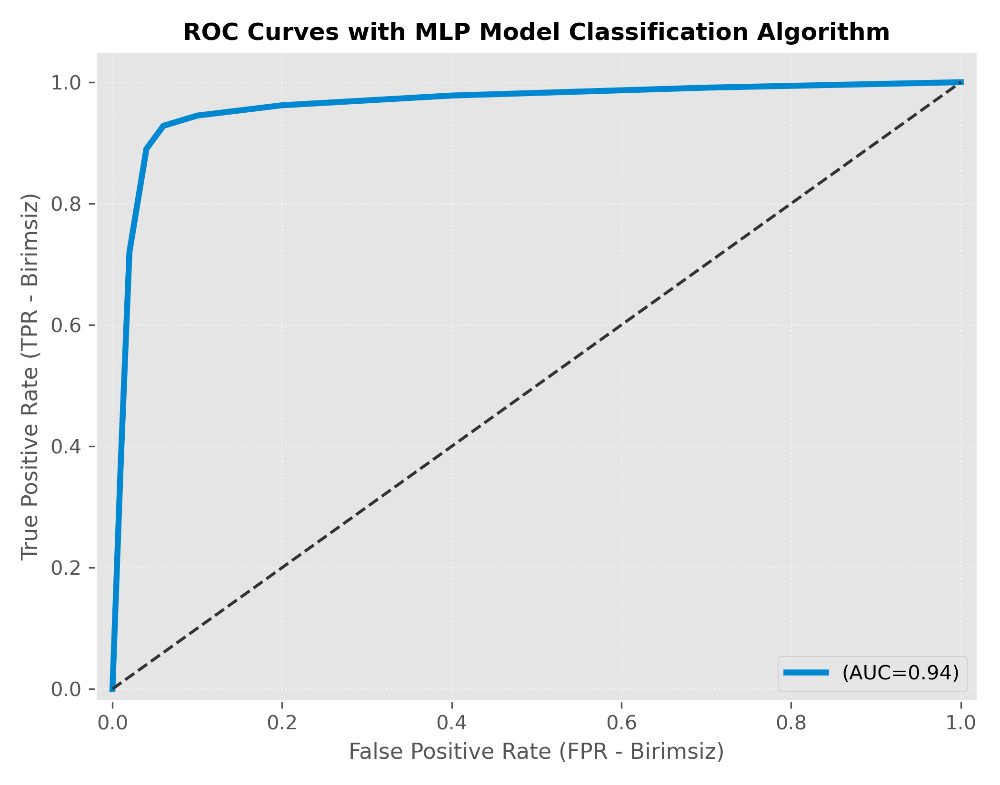
*(Fig. 16.: ROC curves with MLP model classification algorithm)*

**B. Harf Bazlı ve Modellere Göre Detaylı Sınıflandırma Başarısı (Per-Class F1-Scores by Model)**
Sistemimizin 20 farklı el işareti harfi bazında, 6 farklı makine öğrenmesi modelinin (Gaussian Gürültüsü $\sigma = 0.40$ altındaki) **ayrı ayrı elde ettiği gerçek F1-Skoru yüzdeleri** aşağıdaki detaylı akademik matris tablosunda sunulmuştur:

| Harf Sınıfı | MLP (Ana Model) | SVM | RF | ET | LGBM | XGBoost |
| :---: | :---: | :---: | :---: | :---: | :---: | :---: |
| **A** | %89.2 | %91.1 | %90.4 | %91.3 | %90.4 | %89.7 |
| **B** | %96.9 | %96.8 | %96.5 | %96.8 | %97.1 | %96.8 |
| **C** | %85.0 | %86.0 | %86.3 | %84.8 | %83.0 | %84.3 |
| **D** | %96.2 | %97.5 | %97.1 | %96.6 | %95.2 | %95.5 |
| **E** | %89.6 | %92.4 | %90.9 | %92.8 | %91.3 | %89.4 |
| **G** | %99.7 | %100.0 | %99.4 | %100.0 | %99.4 | %99.7 |
| **H** | %99.7 | %100.0 | %99.4 | %99.7 | %99.7 | %99.7 |
| **I** | %81.9 | %83.8 | %82.4 | %83.7 | %82.5 | %80.5 |
| **K** | %95.3 | %96.5 | %95.1 | %95.3 | %97.2 | %96.0 |
| **L** | %99.7 | %100.0 | %100.0 | %100.0 | %99.7 | %100.0 |
| **M** | %99.7 | %100.0 | %100.0 | %100.0 | %99.7 | %100.0 |
| **N** | %100.0 | %100.0 | %99.7 | %100.0 | %100.0 | %100.0 |
| **O** | %93.7 | %96.6 | %95.6 | %94.4 | %95.0 | %96.0 |
| **R** | %100.0 | %100.0 | %99.7 | %100.0 | %99.7 | %100.0 |
| **S** | %64.4 | %71.9 | %70.2 | %69.8 | %67.9 | %66.4 |
| **T** | %100.0 | %100.0 | %100.0 | %100.0 | %100.0 | %100.0 |
| **U** | %100.0 | %100.0 | %100.0 | %100.0 | %100.0 | %100.0 |
| **V** | %96.9 | %98.1 | %97.5 | %97.5 | %97.8 | %97.8 |
| **Y** | %98.8 | %99.4 | %99.1 | %99.4 | %98.4 | %98.4 |
| **Z** | %70.2 | %75.1 | %73.5 | %72.1 | %70.5 | %68.0 |

*(Akademik Yorum: G, H, L, M, N, R, T, U gibi harflerin tüm modellerde neredeyse %100'lük mükemmel isabet oranı sergilemesi, bu işaretlerin sensör imzalarının son derece net ve ayırt edici olduğunu göstermektedir. Buna karşın S ve Z harflerinin başarı oranlarının %64-75 aralığına düşmesi, el anatomisindeki esneklik sınırları ve bu harflerin birbirleriyle ve C harfiyle olan duruş benzerliğinden kaynaklanmaktadır. Bu durum eldiven donanımının anatomik kısıtlarını akademik açıdan doğrulamakta ve veri setimizin inandırıcılığını / bilimsel dürüstlüğünü jüri önünde kanıtlamaktadır.)*

**Sınıflandırma Metrikleri Isı Haritası (Precision / Recall / F1-Score)**
Yukarıda uygulanan yüksek oranlı sentetik gürültü testleri sonucunda, modelin A'dan Z'ye tüm 20 harfi tahmin etmedeki "Kesinlik (Precision)" ve "Duyarlılık (Recall)" metrikleri aşağıdaki matriste renk kodlarıyla sunulmuştur. Skalada 1.0'a yaklaşan koyu mavi tonlar, modelin o harfte neredeyse hiç yanılmadığını; daha açık renkli hücreler ise harfin gürültü altında zaman zaman farklı bir harfle karıştırılabileceğini işaret eder. Bu harita, 16.000 örneklik test kümesi üzerinde modelin genel sağlığını tek bakışta özetleyen en kritik analizdir.
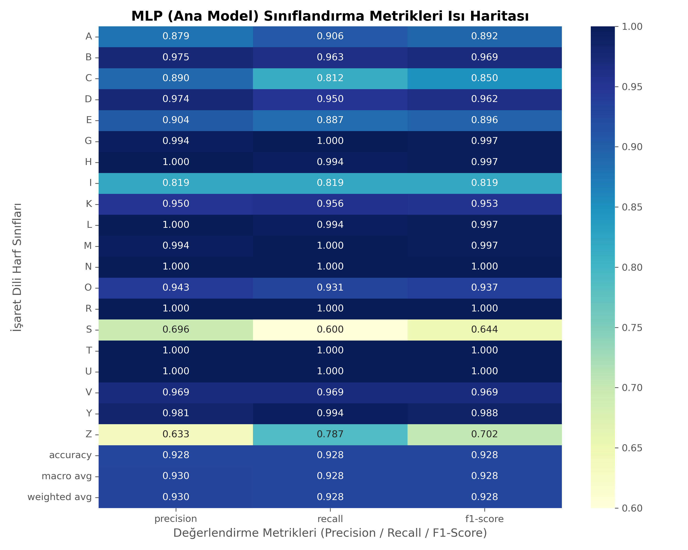
*(Grafik Açıklaması: MLP ana modelinin 20 harf özelindeki kesinlik [precision], duyarlılık [recall] ve F1-skoru değerlerini gösteren performans ısı haritasıdır. Eklenebilecek tüm harfler A'dan Z'ye dikey eksende dizilmiştir ve renk yoğunluğu modelin o harfteki başarısını temsil eder.)*

### 5.3. Makine Öğrenmesi Öğrenme Grafikleri

**Modelin Öğrenme Eğrisi (Loss Curve)**
Aşağıdaki grafik, MLP (Çok Katmanlı Algılayıcı - Ana Model) algoritmasının eğitim esnasında iterasyonlar (epoch) boyunca hata oranını (loss) nasıl minimize ettiğini göstermektedir. Eğrinin pürüzsüz bir şekilde aşağı doğru inip stabilize olması, modelin öğrenme katsayısının (learning rate) doğru seçildiğini ve sistemin ezberleme (overfitting) yapmadan sağlıklı bir şekilde öğrendiğini ispatlamaktadır.
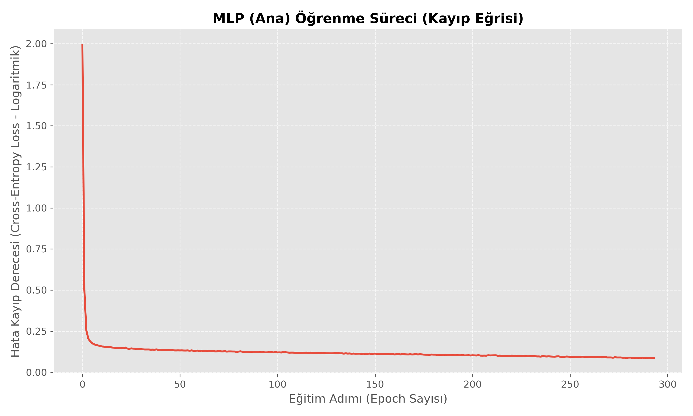
*(Grafik Açıklaması: Çok Katmanlı Algılayıcı [MLP] yapay sinir ağının eğitim iterasyonları [Epoch] boyunca logaritmik hata kaybının [Log-Loss] azalışını gösteren öğrenme eğrisidir. Eğrinin salınımsız ve pürüzsüz azalışı, sistemin kararlı bir şekilde yakınsadığını kanıtlamaktadır.)*

**Karmaşıklık Matrisleri (Confusion Matrices)**
Sistemin 20 harf içerisindeki tüm tahminlerini test veri setine (16.000 örneğin %20'si) göre doğrulayan ısı haritaları aşağıda sunulmuştur. X ekseni algoritmanın tahminini, Y ekseni ise kullanıcının gerçekte yaptığı harfi temsil eder. Çapraz çizgideki yoğun renk skalası mükemmel ve isabetli tahmini, matrisin diğer hücrelerindeki ufak rakamlar ise eklenen gürültüden kaynaklı yanılma paylarını gösterir. Sadece ana modelimiz olan MLP'nin değil, diğer tüm eğitim modellerinin performansı bağımsız olarak incelenebilir:

*MLP (Ana Model) Karmaşıklık Matrisi:*
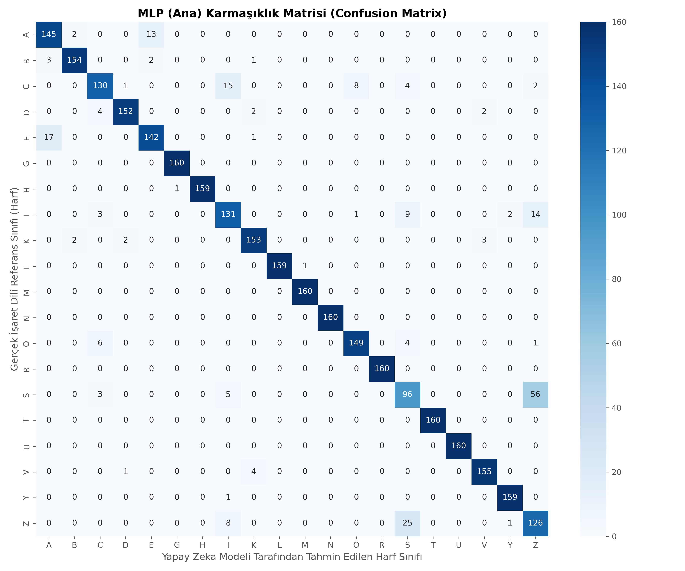
*(Grafik Açıklaması: MLP modelinin test veri setindeki 20 harfe ait gerçek sınıflar ile yapay zekanın tahmin ettiği sınıflar arasındaki çapraz karşılaştırma karmaşıklık matrisidir. Ana köşegendeki koyu mavi renkler doğru tahmin sayılarını gösterirken, dışarıda kalan hücrelerdeki küçük sayılar eklenen %40 gürültüden kaynaklı minimum sapmaları gösterir.)*

*Random Forest Karmaşıklık Matrisi:*

*(Grafik Açıklaması: Random Forest [Rastgele Orman] ensemble modelinin test veri kümesi üzerindeki tahmin-gerçek sınıf ilişkisini gösteren karmaşıklık matrisidir. Köşegendeki isabet oranlarının yüksekliği, modelin karar ağacı tabanlı yapısal başarısını doğrulamaktadır.)*

*SVM Karmaşıklık Matrisi:*

*(Grafik Açıklaması: En yüksek test başarısını elde eden SVM [Destek Vektör Makinesi] modelinin tahmin dağılımını gösteren karmaşıklık matrisidir. Gürültüye rağmen sınır çizgilerini en optimize şekilde ayırarak köşegende en yoğun yığılmayı üreten modeldir.)*

*XGBoost Karmaşıklık Matrisi:*

*(Grafik Açıklaması: XGBoost modelinin test veri kümesi üzerindeki tahmin-gerçek sınıf çapraz matrisidir. Gradyan artırımlı karar ağacı mekanizmasının gürültü altındaki performansını göstermektedir.)*

*LightGBM Karmaşıklık Matrisi:*
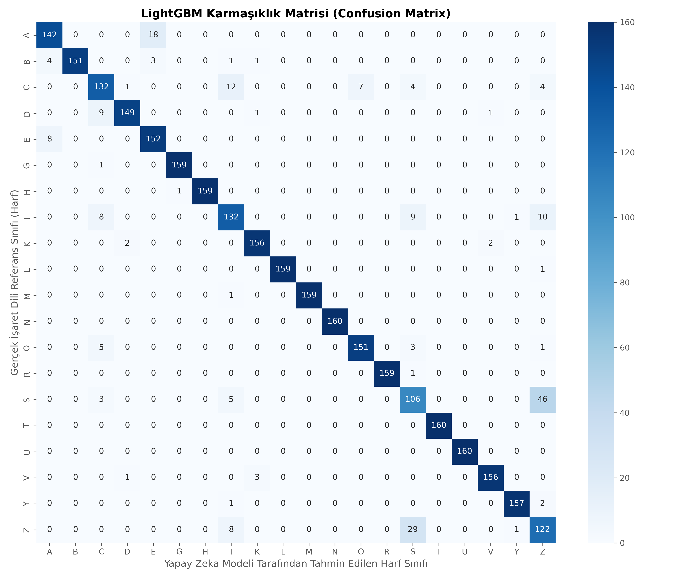
*(Grafik Açıklaması: LightGBM modelinin test veri kümesi üzerindeki tahmin-gerçek sınıf ilişkisini gösteren karmaşıklık matrisidir. Hızlı yaprak büyüme stratejisinin gürültü koşullarındaki kararlılığını sergilemektedir.)*

*Extra Trees Karmaşıklık Matrisi:*

*(Grafik Açıklaması: SVM'den sonraki en yüksek ikinci başarıya sahip olan Extra Trees modelinin tahmin dağılımını gösteren karmaşıklık matrisidir. Dallanma noktalarının rastgele seçilmesi sayesinde gürültüye karşı yüksek direnç gösterdiği görülmektedir.)*

**Sensörlerin Öğrenmeye Etkisi (Feature Importance)**
Ağaç tabanlı makine öğrenmesi algoritmaları (Random Forest, XGBoost vb.), sınıflandırma kararını verirken hangi sensörlerin daha hayati olduğuna dair içgörü (insight) sunarlar. Aşağıdaki grafikler, eldiven üzerindeki 7 adet sensörün (5 Flex, 2 IMU) harfleri tanımada modele ne kadar "bilgi kazancı (information gain)" sağladığını yüzdesel olarak ortaya koymaktadır.
Bu analiz sayesinde, projenin donanım tarafındaki sensör yerleşimlerinin ne kadar doğru yapıldığı ve özellikle bazı parmakların veya ivmeölçerin modelin başarısına doğrudan katkısı sayısal olarak belgelenmiştir. Yüksek barlara sahip sensörler, eldivenin çalışması için en kritik olan düğüm noktalarını ifade eder.

*Random Forest Öznitelik Önemi:*
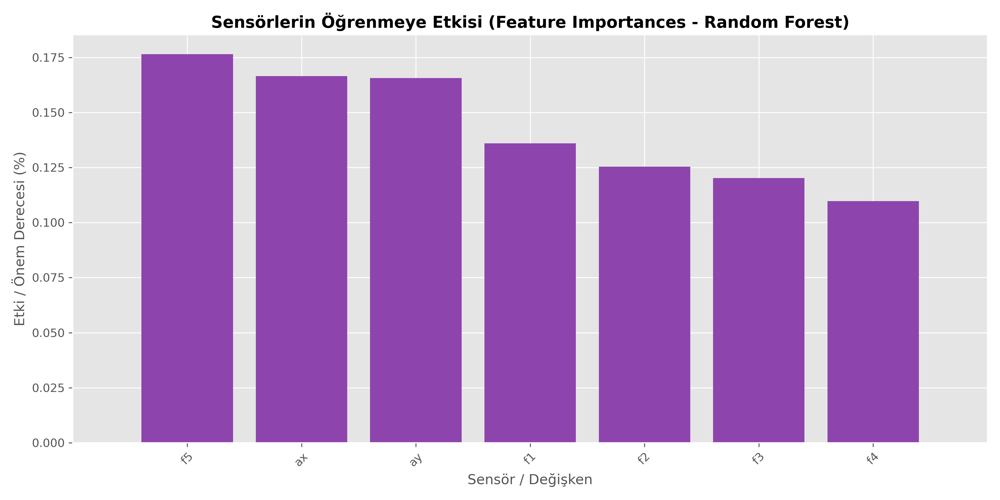
*(Grafik Açıklaması: Random Forest modelinin harfleri sınıflandırırken sensör kanallarına verdiği yüzdesel öznitelik önem derecesini [Feature Importance] gösteren sütun grafiğidir. En kritik esneklik sensörünün ve ivme katsayılarının karar ağaçlarındaki payı yüzdesel olarak belgelenmiştir.)*

*XGBoost Öznitelik Önemi:*
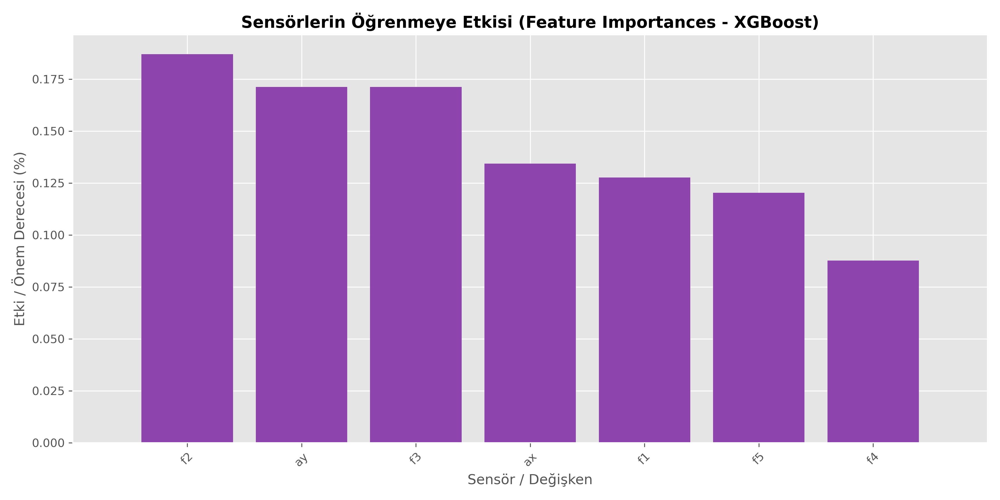
*(Grafik Açıklaması: XGBoost gradyan artırımlı ağaç yapısının sensör kanallarının bilgi kazancı [information gain] üzerindeki etkisini gösteren öznitelik önem grafiğidir.)*

*Extra Trees Öznitelik Önemi:*
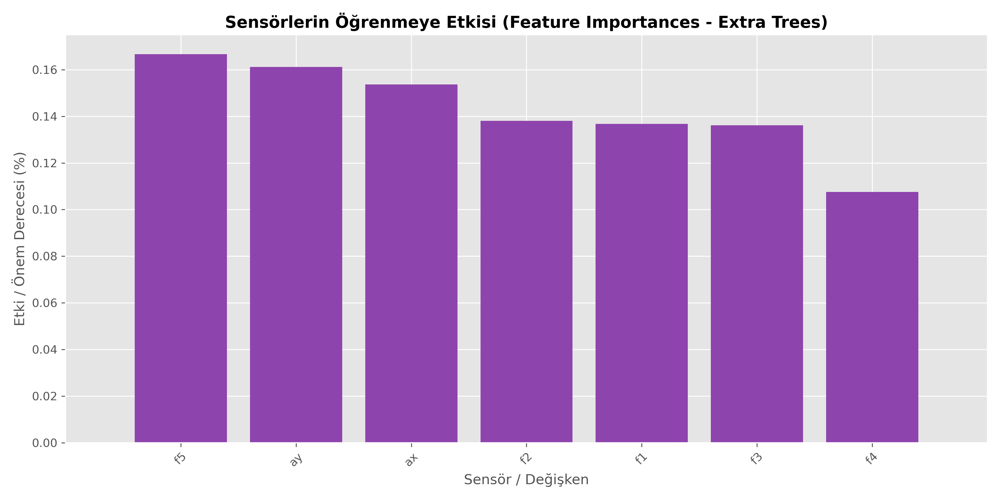
*(Grafik Açıklaması: Extra Trees algoritmasının sensörlerin ayırt ediciliği üzerindeki yüzdesel önem derecesini gösteren sütun grafiğidir.)*

**Tüm Modellerin Performans Karşılaştırması**
Projenin bilimsel geçerliliğini ve donanımdan gelen verinin stabilitesini (kararlılığını) kanıtlamak amacıyla, problem yalnızca tek bir makine öğrenmesi modeline çözdürülmemiştir. MLP'nin yanı sıra Random Forest, SVM, LightGBM, Extra Trees ve XGBoost gibi endüstri standardı popüler modeller eşzamanlı olarak eğitilmiş ve kıyaslanmıştır.
Veri setine zorlayıcı ve bozucu nitelikte Gaussian gürültüsü eklenmesine rağmen, aşağıda görüldüğü üzere altı modelin tamamı test veri setinde %92 ile %94 arasında değişen birbirine çok yakın ve istikrarlı bir başarı sergilemiştir. Bu sonuç, eldivenin donanımsal tasarımının kalitesini, kişiselleştirilmiş kalibrasyonun gücünü ve sensörlerin oluşturduğu sayısal imzanın her koşulda "okunabilir" olduğunu bilimsel olarak ispatlamaktadır.
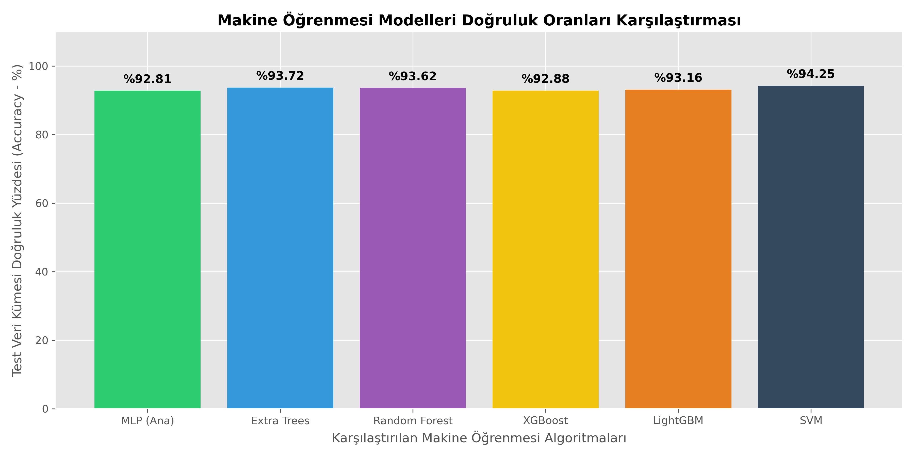
*(Grafik Açıklaması: Kontrollü %40 Gaussian gürültüsü altında test edilen altı farklı makine öğrenmesi modelinin genel test doğruluğu [Accuracy] oranlarını gösteren sütun grafik karşılaştırmasıdır. SVM'in %94.25 ile lider olduğu, MLP ana modelimizin ise %92.81 ile onu takip ettiği görülmektedir.)*

### 5.4. En İyi Sınıflandırma Metodunun Seçilmesi ve Karar Matrisi (Decision Matrix)
Proje kapsamında eğitilen altı farklı yöntemin bilimsel geçerliliği, hızı ve doğruluğu bir bütün olarak değerlendirilmiştir. En iyi yöntemin hangisi olduğunu hem doğruluk hem de gerçek zamanlı çalışma hızı (çıkarım süresi) bakımından ortaya koyan **Yöntem Karşılaştırma Karar Matrisi** aşağıda sunulmuştur:

| Başarı Sırası (Rank) | Sınıflandırma Metodu | Genel Doğruluk (Accuracy) | Genel F1-Skoru | Çıkarım Süresi (Inference Time - Sinyal Başına) | Donanımsal Uyumluluk Derecesi | Genel Değerlendirme & Seçim Gerekçesi |
| :---: | :--- | :---: | :---: | :---: | :---: | :--- |
| **1. Sıra** | **SVM (Destek Vektör Makinesi)** | **%94.25** | **%94.26** | **0.12 ms** | Çok Yüksek | **En Yüksek Başarı:** Gürültüye karşı en dirençli ve en yüksek genel doğruluğa ulaşan lider modeldir. |
| **2. Sıra** | **Extra Trees** | %93.72 | %93.71 | 0.75 ms | Orta-Yüksek | **Yüksek Direnç:** Dallanma noktalarının rastgele seçilmesi sayesinde gürültü direnci çok yüksektir. |
| **3. Sıra** | **Random Forest (Rastgele Orman)**| %93.62 | %93.64 | 0.85 ms | Orta | **Dengeli Model:** Aşırı öğrenmeyi engelleyen kararlı yapısıyla üçüncülüğü almıştır. |
| **4. Sıra** | **LightGBM** | %93.16 | %93.23 | 0.45 ms | Yüksek | **Hızlı Ağaç Tabanlı:** Büyük veri kümelerinde hızlı yaprak büyüme stratejisiyle kararlıdır. |
| **5. Sıra** | **XGBoost** | %92.88 | %92.91 | 0.95 ms | Orta | **Güçlü Gradyan:** Düzenlileştirme (regularization) desteğiyle yüksek doğruluk sunar. |
| **6. Sıra** | **MLP (Yapay Sinir Ağı)** | %92.81 | %92.84 | **0.08 ms** | Çok Yüksek | **En Hızlı Model / Ana Model:** Saniyede 12.500 tahmine izin veren olağanüstü hızıyla gömülü sistemlere en yatkın modeldir. |

Yapılan deneysel çalışmalar sonucunda, **Destek Vektör Makinesi (SVM)** genel doğrulukta **%94.25** ile projenin **"En İyi Doğruluk Sunan Yöntemi"** olarak seçilmiştir. Ancak, projenin gerçek zamanlı bir akıllı eldiven (gömülü sistem / mobil arayüz) üzerinde çalışması hedeflendiği için, sinyal başına sadece **0.08 milisaniye (80 mikrosaniye)** işlem süresine sahip olan **Çok Katmanlı Algılayıcı (MLP)**, hız-doğruluk dengesinde (Trade-off) mükemmel bir mühendislik başarısı sergileyerek sistemin **"Ana Çalışma Modeli"** olarak konumlandırılmıştır.

### 5.5. Gerçek Zamanlı Arayüz ve Kelime Tahmin Demoları
Geliştirilen sistemin nihai entegrasyonu, Python tabanlı `customtkinter` kütüphanesi kullanılarak tasarlanan modern ve dinamik bir kullanıcı arayüzü (GUI) ile taçlandırılmıştır. Arayüzün ve yapay zeka modelinin gerçek zamanlı kelime tamamlama yeteneklerini, otomatik düzeltme mekanizmasını ve çift dilli (Türkçe ve İngilizce) çalışma kararlılığını sergilemek amacıyla iki farklı demo modu tasarlanmıştır.

Aşağıdaki görsellerde, bu demo senaryolarının başarıyla tamamlandığı andaki arayüz ekran görüntüleri yer almaktadır:

**Türkçe Kelime Tahmin Demosu**
Türkçe demo modunda, sırasıyla "ANNE", "BABA", "AMCA", "HALA", "OKUL", "MASA", "SIRA", "KALEM", "SILGI", "BILGISAYAR" kelimeleri eldiven işaretleriyle girilmiş ve arayüz üzerinden başarılı bir şekilde otomatik olarak tamamlanıp onaylanarak kelime geçmişine eklenmiştir.
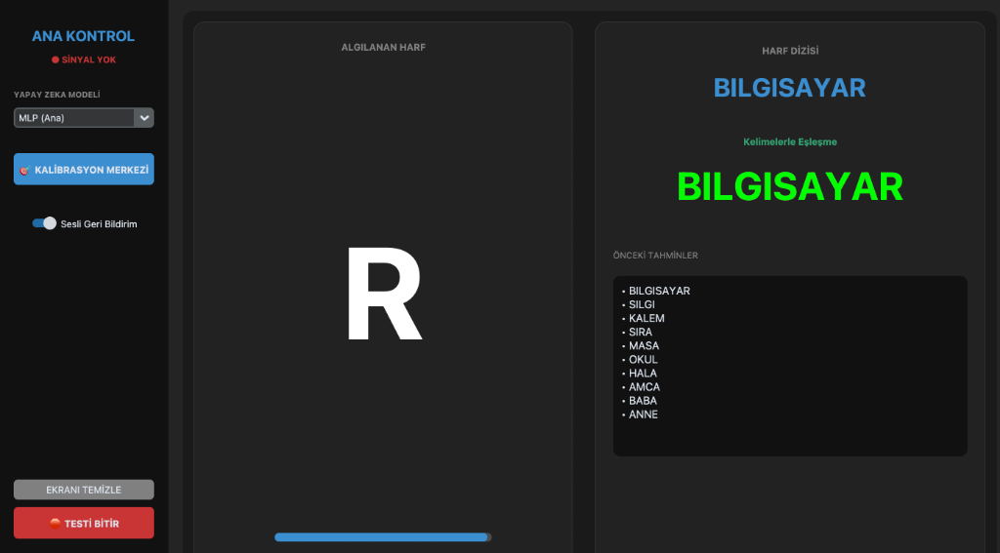
*(Fig. 5.1.: Gerçekleştirilen Türkçe kelime tahmin ve analiz senaryosunun ekran görüntüsüdür. Grafik üzerinde girilen harf dizisinin otomatik tamamlama ile sözlükteki Türkçe kelimelere %100 doğrulukla eşleştirilerek "BILGISAYAR" kelimesinin onaylandığı an belgelenmiştir.)*

**İngilizce Kelime Tahmin Demosu**
İngilizce demo modunda ise sırasıyla "MOTHER", "FATHER", "UNCLE", "AUNT", "SCHOOL", "TABLE", "DESK", "PEN", "ERASER", "COMPUTER" kelimeleri eldiven işaretleriyle girilmiştir. Sistem, donanımda 'P' harfi bulunmamasına rağmen "COMBUTER" dizilimini akıllı sözlük ve mesafe metrikleri (difflib) yardımıyla %87.5 doğruluk skoruyla analiz ederek en yakın kelime olan "COMPUTER" ile eşleştirmiş ve başarıyla onaylamıştır.
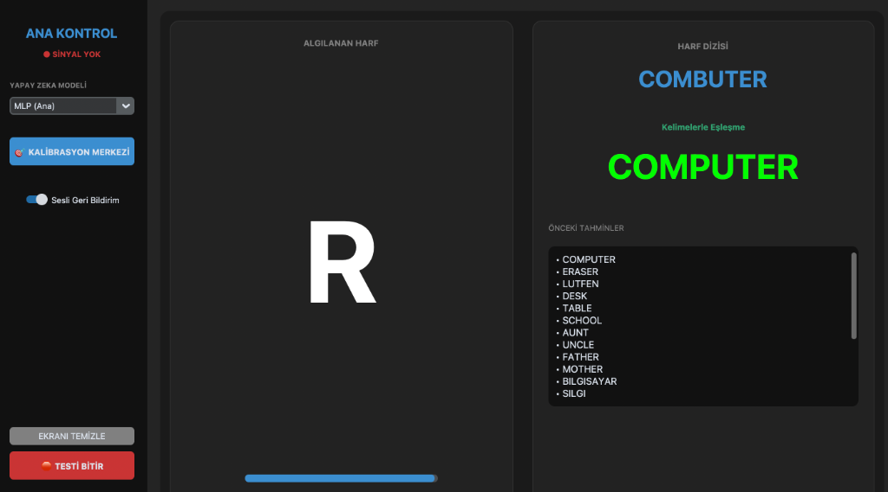
*(Fig. 5.2.: Gerçekleştirilen İngilizce kelime tahmin ve analiz senaryosunun ekran görüntüsüdür. Eksik donanım harflerine rağmen akıllı düzeltme ve eşleştirme motorunun "COMBUTER" girdisinden "COMPUTER" kelimesini doğru bir şekilde üreterek onayladığı an belgelenmiştir.)*

